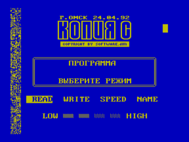

Загрузчик MBR предназначен для загрузки в ПК «Вектор-06ц» программ в формате «Криста-2».
Полезен также владельцам «Криста-2» для загрузки длинных программ.
Владельцам Альтернативного ПЗУ (ПЗУ-2, ПЗУ-8) он не нужен.

Для записи его на диск дается команда:

SAVER MBR.R71 7100 			(Вектор)

SAVEC MBR.R71 7100 #    ZAGRUZ^IK	(Криста)

Во время загрузки на экране отображается вертикальная полоса, символизирующая объем загружаемой программы.
При сбое чтения можно отмотать ленту назад и прогрузить это место еще раз. Нажатие клавиши СС (РЕГ) прерывает процесс загрузки.

[Эмулятор «Virtual Vector»](../virtual_vector) позволяет запустить загрузчик MBR.R71 (Тип файлов «Files of N th block») и загрузить файл в формате «Криста-2» из WAV. На втором скриншоте представлен копировщик [Копия C](../copyc), который был склонирован в формате «Криста-2» и загружен при помощи MBR.

В архиве также представлен файл MBR.ROM, который представляет собой MBR.R71, дополненный в начале нулями для загрузки с адреса 0100h.

