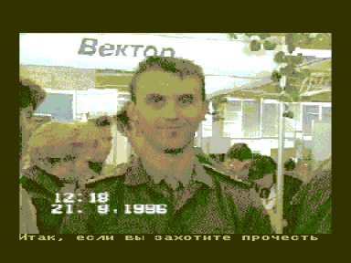

Первый номер вышел в 1996 г. под редакцией Сергея Кучеренко, г.Вышгород.

Koмпьютер "Вектор-06ц" распространен широко в пределах бывшего Союза.
Пользователей — тысячи, а информации по "Вектору" очень мало.
Литературы — никакой!
Возникает вопрос: как можно осваивать ПК в таком информационном ваккууме?

На этот вопрос была призвана ответить газета Микро.
Само издание было текстовым, но к нему выходило электронное приложение рекламного характера, состоящее обычно из полноэкранной картинки и скроллера с посланием общественности.

