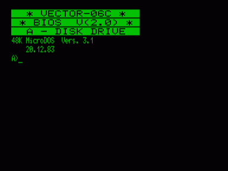

Версия МикроДОС, предназначенная для работы с квазидиском без дисковода.

Описание МикроДОС: [http://github.com/svofski/vector06cc/wiki/MicroDOS_manual](http://github.com/svofski/vector06cc/wiki/MicroDOS_manual)

