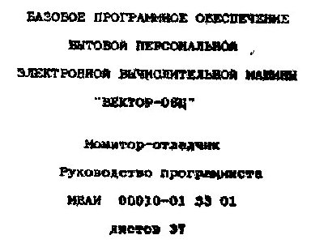

«Монитор-отладчик» руководство программиста [Монитор-отладчик 2.5](../mon25).

В данном документе приводится руководство программиста по монитору-отладчику для БПЭВМ «ВЕКТОР-06Ц».

Монитор-отладчик состоит из двух частей.
Первая часть &ndash; собственно монитор-отладчик, вторая часть &ndash; имитатор дисковой операционной системы (ДОС).

В руководстве программиста отражено назначение и условия применения монитора-отладчика и имитатора ДОС, обращение к нему, описание команд монитора-отладчика и функций имитатора ДОС, сообщения программисту.

