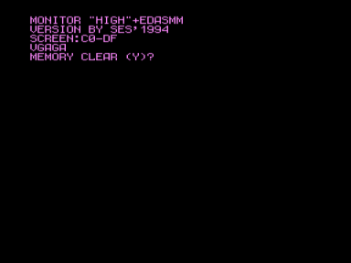

[Monitor «HIGH»+EDASM](.).

ivagor > Если очень хочется попрограммировать в EDASMе на голом реале, то есть очень простой вариант — можно взять сборку Monitor «HIGH»+EDASM, которую сделал SES. Там экран 8 Кб, не 16, т.е. больше свободного места, буквы в 2 раза шире.

См.также [Ассемблер-редактор v1.4](../../edasm)

