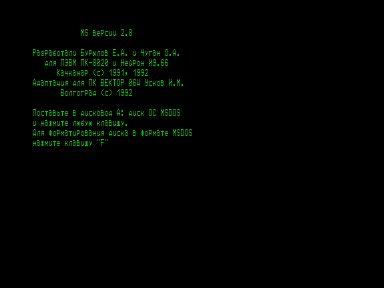
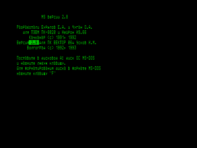

Программа для работы на векторе с IBMовскими дисками.

Программа создавалась для передачи файлов данных с дисков двойной плотности (МЧМ) операционных систем MS-DOS, ADOS и др. на диски машины «Корвет», а также в обратном направлении.
С успехом может быть использована для передачи обычных текстов и текстов программ на языках высокого уровня, записанных в символьном виде.





## Форматы дисков

Допустимые форматы дисков для программы MS определяются автоматически (операционная система MS-DOS):

- размер сектора 512 байт;
- 160 K (1 сторона, 40 дорожек, 8 секторов на дорожку);
- 180 K (1 сторона, 40 дорожек, 9 секторов на дорожку);
- 320 K (2 стороны, 40 дорожек, 8 секторов на дорожку);
- 360 K (2 стороны, 40 дорожек, 9 секторов на дорожку);
- 720 K (2 стороны, 80 дорожек, 9 секторов на дорожку, размер кластера 512 байт);
- 720 K (2 стороны, 80 дорожек, 9 секторов на дорожку, размер кластера 1024 байта).

**Внимание!**
На некоторых машинах (Искра 1030.11) используется нестандартный формат 360 K (1 сторона, 80 дорожек).
Для обмена с такими машинами используйте формат 180 K или заказывайте модификацию программы MS по адресу: Волгоград 400119, а/я 2684, мп «Вираж».

**Внимание!**
Формат 800 K не поддерживается.
Не пытайтесь с ним работать!

**Внимание!**
Так как 80-дорожечные дисководы имеют меньшую ширину дорожки, чем 40-дорожечные, то при записи на 40 дорожек, сделанные на 80-дорожечном дисководе, могут читаться на 40-дорожечном со сбоями.

## Запуск программы

Программа запускается с текущего диска C, для диска другой системы назначается дисковод A.

После запуска программы опрашивается наличие диска в дисководе A и, если он вставлен, проверяется его принадлежность к соответствующей операционной системе.
Затем программа подключается к этому диску.
В случае, если диск не соответствует данной операционной системе, выдаётся сообщение «НЕОПОЗНАВАЕМЫЙ ДИСК», и происходит выход в операционную систему.

Если диска A не оказалось, то программа приглашает поставить его или отформатировать диск в формате соответствующей операционной системы.

После подключения к диску выводится приглашение `->`, и программа ожидает ввода команды.

## Описание команд

Все команды вводятся нажатием одной клавиши (начальной буквой слова команды) без ВК.
В ответ на экран выводится оставшаяся часть слова команды, и она начинает выполняться.

- **`<?>`** — вывод краткой справки.
  После нажатия клавиши `<?>` экран очищается и выводится краткий список команд.

- **`<D>ir`** — вывод оглавления диска A.
  Имена файлов в оглавлении могут быть отфильтрованы по шаблону, задаваемому обычными символами `*` и `?`, например:

  ```
  ->Dir A:?A*.*
  ```

  Выводятся файлы с именами SAMF.COM, MAC.COM, MAX.TXT и другие, с буквой A на втором месте в имени файла.
  В случае, если фильтрация не нужна, вместо шаблона вводится ВК.

  Внимание! MS не выводит подкаталоги и их содержимое!

- **`<T>ype`** — распечатка текстовых файлов на экран или на принтер.
  После ввода команды на экран выводится пронумерованное оглавление диска B (может быть отфильтровано).
  Файлы выбираются по их номерам в оглавлении:

  ```
  ->Type A:
     1=POWER   .COM 14848 байт      2=DOC     .     5632 байта
     3=DOC     .BAK  5248 байт      4=W       .L     384 байта
     5=TST     .TXT   768 байт      6=TST2    .      384 байта
  Ваш выбор? 2 4-6
  ```

  Номера 2 4-6 выбирают файлы DOC, W.L, TST.TXT, TST2.
  После выбора файлов задаются вопросы о перекодировке текста и выводе на принтер.
  Вывод текста можно прервать, нажав клавишу `<ESC>`, или приостановить, нажав на любую другую.

  О перекодировке в программе MS: в системе MS-DOS обычно используется альтернативная кодировка символов.
  Символы псевдографики будут распечатаны правильно на принтере «EPSON» или подобном в системе с драйвером принтера FX803.
  Пользуясь файлом TST.TXT, в котором последовательно записаны символы с кодами от 80h до FFh, можно получить полное представление о перекодировках символов.

- **`<R>ead`** — перепись файла с диска A на квазидиск.
  Выбор и перекодировка символов те же, что и в команде Type.
  Процесс передачи сопровождается выводом на экран символов `*`.
  Одна звёздочка соответствует одной единице размещения файлов на диске.
  Выполнение команды можно прервать, нажав клавишу `<ESC>`.

- **`<W>rite`** — перепись файла CP/M на диск A — аналогично Read.

- **`<N>ew disks`** — обновление дисков.
  Команда должна выполняться каждый раз при смене любого диска (CP/M или диска A).
  Команда полезна также при подозрении на неправильную работу программы с дисками.

- **`<E>rase`** — стирание файлов на диске A.
  Выбор файлов тот же, что и в команде Type.

- **`<M>odify`** — переименование файлов на диске A.
  Выбор файлов тот же, что и в команде Type.

- **`<F>ormat`** — форматирование (создание) диска A.

- **`<F4>`** — выход в операционную систему.
