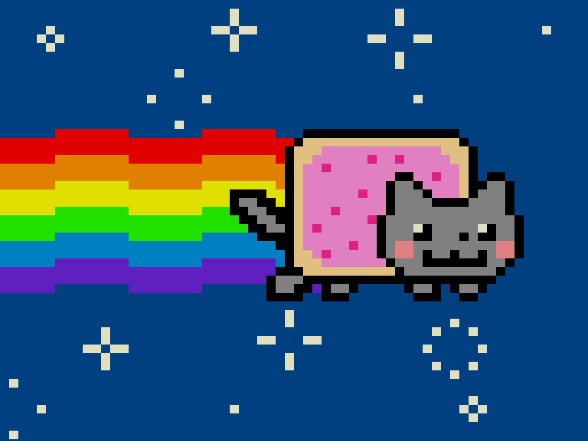

Кот-поптарт с радужным хвостом летит сквозь звёзды, на фоне играет тема мема на AY-3-8910. Использовался Opus 5.



Кот, радуга, звёзды и палитра сняты с оригинальной анимации с [nyan.cat](https://www.nyan.cat/) и перенесены пиксель в пиксель.
Готовый образ - `nyancat.rom`, **2534 байта**, грузится с адреса 0100h.

## Как запустить

Файл `.rom` понимают все эмуляторы «Вектора»: [v06x](https://github.com/svofski/vector06sdl), [Emu80](https://github.com/vpyk/emu80v4), эмулятор [Дмитрия Целикова](https://bashkiria-2m.narod.ru/).

```
v06x --rom nyancat.rom
```

Для звука нужен включённый AY (порты 14h/15h).
Без платы AY картинка и анимация работают, но играть будет нечему - демка не использует встроенный таймер ВИ53.

## Как собрать

```
python3 build.py          # -> ../nyancat.rom
```

Скрипт рисует все кадры, сочиняет таблицы музыки, собирает `nyancat.asm` ассемблером [v6asm](https://github.com/parallelno/v6asm), упаковывает образ и вторым проходом приклеивает поток к загрузчику.
Готовый ROM тут же прогоняется в [v6emul](https://github.com/parallelno/v6emul): демка должна распаковаться, ожить и начать рисовать.

Нужны `v6asm`, `v6emul` и python3 с numpy и PIL.
Без `v6emul` сборка проходит, просто пропускает проверку.

Собрать с профилированием - цвет бордюра покажет, какая фаза отрисовки идёт прямо сейчас:

```
python3 build.py --profile
```

Самотесты:

```
python3 pack.py           # упаковщик: разворот туда-обратно, 200 случайных наборов
python3 art.py p.png      # превью шести кадров анимации
python3 music.py m.wav    # референсный WAV аранжировки (меандры, без AY)
```

## Из чего состоит

| файл | что делает |
| --- | --- |
| `nyancat.asm` | сама демка: рендерер, аниматор, плеер AY |
| `loader.asm` | стаб по адресу 0100h: распаковывает образ в 4000h и передаёт управление |
| `art.py` | кадры кота, палитра, радуга, звёзды, эталонный рендер сцены |
| `music.py` | транскрипция темы, гармония, таблицы периодов AY |
| `pack.py` | LZSS-упаковщик, пара к распаковщику из `loader.asm` |
| `build.py` | сборка `nyancat.rom` |
| `verify.py` | побитовая сверка кадров эмулятора с эталоном и разбор записи звука |

---

# Откуда взялась графика

Первая версия демки рисовалась «по мотивам»: пропорции снимались с демки Nyan Cat для Commodore 16, а рисунок набирался вручную.
Получалось похоже, но не то.
Поэтому вся графика была переснята с самого оригинала - анимации Кристофера Торреса (prguitarman) в раскадровке saraj00n, той самой, что крутится на [nyan.cat](https://www.nyan.cat/).

**Кот** - `https://www.nyan.cat/cats/original.gif`.
Это GIF 272×168 на 12 кадров, но кадры 6..11 побитово повторяют 0..5, то есть кадров реально шесть.
Внутри кадра каждый пиксель - ровно блок 8×8 одинаковых точек, так что картинка честно уменьшается до **34×21 «крупных пикселя»** без потерь.
Прозрачность в GIF - отдельный индекс палитры (7), совпадающий по цвету с белым (6), поэтому кадры разбирались по индексам палитры, а не по RGB: иначе белки глаз слились бы с фоном.
Полученные 34×21 лежат в `art.CAT_FRAMES` как ASCII-арт, буква на пиксель, и это единственный источник рисунка кота - покачивание тела, три положения хвоста, четыре лапы и отдельный диагональный сдвиг головы уже внутри кадров, ничего не пересобирается на лету.

Тело в кадрах смещается по вертикали на 0, 0, 1, 1, 1, 1, а голова - на (0,0), (+1,0), (+1,+1), (+1,+1), (0,+1), (0,0).
Голова живёт своей жизнью относительно тела: это ручная анимация, а не программный сдвиг, и именно поэтому кадры хранятся целиком.

**Радуга** - `https://www.nyan.cat/images/thumbs/nyan.gif`.
Миниатюра со страницы выбора «вкусов» - это вся сцена целиком, 106×42, то есть **53×21 крупных пикселя** в той же сетке, что и кот.
По ней восстановлена геометрия: полоса **3 строки** на цвет, шесть цветов, сегмент ступеньки **8 пикселей**, сама ступенька - **1 строка**.
Начало «верхнего» сегмента по кадрам - 1, 0, 9, 8, 1, 0 (в координатах миниатюры).
То есть радуга не просто мигает двумя фазами: каждый кадр она ещё и дёргается на пиксель по горизонтали.
Кот при этом стоит на месте - это проверено по краям корочки, они во всех шести кадрах в столбцах 27..45.

Правый край радуги совпадает с границей сегмента: у чётных кадров она заканчивается на 14-м пикселе кота, у нечётных - на 13-м.
Мелочь на один пиксель, но без неё в пятом кадре над поп-тартом висит одинокая красная точка.

**Звёзды** - `style/base2.css` с той же страницы, классы `.star .dot`.
На сайте звезда собрана из девяти div-ов, которые по шести кадрам разъезжаются от центра лучами на 1, 2 и 3 позиции, а в пятом кадре добавляются диагонали.
Это разобрано в `art._STAR_DOTS` и разворачивается в шесть спрайтов 7×7.

**Цвета** - оттуда же: фон `#0f4d8f` (это `background` из `base2.css`), радуга `#ff0000` `#ff9900` `#ffff00` `#33ff00` `#0099ff` `#6633ff` (правила `.wave-1`..`.wave-6`), остальное - из палитры GIF: шерсть `#999999`, глазурь `#ff99ff`, посыпка `#ff3399`, щёки `#ff9999`, корочка `#ffcc99`, контур `#000000`, глаза белые.

`art.scene()` - эталонный рендер сцены на Python - совпадает с оригинальной анимацией **пиксель в пиксель на всех шести кадрах** (сверка по миниатюре, 52 столбца × 21 строка × 6 кадров, 0 расхождений; нулевой столбец у миниатюры обрезан композицией страницы и не сверяется).

## Почему сетка 64×51, а не 64×64

У «Вектора» экран 256×256, а показывается он на кадре 4:3.
Значит, экранная точка в 4/3 раза шире, чем выше, и «крупный пиксель» из блока 4×4 точки выходит растянутым по горизонтали на треть.
Первая версия компенсировала это растяжкой самого рисунка по вертикали (20 арт-юнитов оригинала превращались в 27 строк), но растяжка пиксель-арта портит его: однопиксельные детали - глаза, рот, посыпка - расползаются несимметрично.

Квадратный блок - это **4 точки в ширину и 5 в высоту**: 4 × 4/3 = 5.33 против 5, ошибка 6.7%, на глаз не видно.
Ширина 4 при этом не выбрана, а вынуждена: байт карты хранит два пикселя по 4 бита и разворачивается ровно в один байт видеопамяти, то есть в 8 экранных точек.
Высота - свободный параметр, и она поднята с 4 до 5.

Отсюда сетка 64×51 вместо 64×64: 51 строка × 5 = 255 точек, самая нижняя строка экрана картой не покрыта и гасится один раз на старте вместе со всей видеопамятью.
Оригинальный арт при такой сетке переносится один в один, без единой продублированной строки.

## Палитра

16 цветов, байт цвета - `%BBGGGRRR` (красный и зелёный по 3 бита, синий 2).
Ниже - что во что превратилось; последний столбец - исходный цвет с nyan.cat.

| # | что это | байт | r g b | на экране | оригинал |
| --- | --- | --- | --- | --- | --- |
| 0 | фон | 90h | r0 g2 b2 | `#0048aa` | `#0f4d8f` |
| 1 | белый: звёзды и глаза | FFh | r7 g7 b3 | `#ffffff` | `#ffffff` |
| 2 | радуга, красный | 07h | r7 g0 b0 | `#ff0000` | `#ff0000` |
| 3 | радуга, оранжевый | 27h | r7 g4 b0 | `#ff9100` | `#ff9900` |
| 4 | радуга, жёлтый | 3Fh | r7 g7 b0 | `#ffff00` | `#ffff00` |
| 5 | радуга, зелёный | 39h | r1 g7 b0 | `#24ff00` | `#33ff00` |
| 6 | радуга, синий | E0h | r0 g4 b3 | `#0091ff` | `#0099ff` |
| 7 | радуга, фиолетовый | CBh | r3 g1 b3 | `#6d24ff` | `#6633ff` |
| 8 | чёрный контур | 00h | r0 g0 b0 | `#000000` | `#000000` |
| 9 | шерсть | A4h | r4 g4 b2 | `#9191aa` | `#999999` |
| 10 | глазурь | E7h | r7 g4 b3 | `#ff91ff` | `#ff99ff` |
| 11 | корочка | B7h | r7 g6 b2 | `#ffdaaa` | `#ffcc99` |
| 12 | посыпка | 8Fh | r7 g1 b2 | `#ff24aa` | `#ff3399` |
| 13 | щёки | A7h | r7 g4 b2 | `#ff91aa` | `#ff9999` |
| 14 | не используется | 40h | r0 g0 b1 | `#000055` | - |
| 15 | маркер прозрачности | C7h | r7 g0 b3 | `#ff00ff` | - |

Номера цветов расставлены не как попало.
Фон - обязательно 0, белый - обязательно 1: у цвета 1 взведён только бит 0, то есть белое на фоне живёт целиком в одной битовой плоскости, и звёзды рисуются в неё одну.
Цвета радуги заняли 2..7, чтобы у них был сброшен бит 3: плоскость 8000h в полосе радуги не меняется, и её блит идёт по трём плоскостям вместо четырёх.
В данных ПЗУ встречаются только цвета 0..13.
Цвет 15 - маркер прозрачности внутри `art.py`: он помечает пустые места в кадрах кота, но до ПЗУ не доходит, потому что блоки кота собираются непрозрачными.
На экране его быть не может, поэтому ему дан ядовитый пурпурный - если он вдруг появится, это сразу видно.
Цвет 14 не используется вовсе, но обязан отличаться от остальных: `verify.py` сверяет кадры по цвету и требует, чтобы все 16 значений палитры были различимы.

---

# Как это устроено

## Раскладка памяти

```
0100h..014Dh   загрузчик-распаковщик, 78 байт
014Eh..0AE5h   упакованный образ, 2456 байт
--- на этом ROM кончается, дальше только ОЗУ ---
4000h..4720h   код демки, 1825 байт
4721h..523Ah   данные, 2841 байт:
                 4721h  палитра, 16 байт
                 4731h  образцы столбца радуги, 4 x 19 = 76
                 477Dh  таблица выбора образца, 4 фазы x 8 = 32
                 479Dh  шесть блоков кота, 6 x (2 + 357) = 2154
                 5007h  указатели на блоки, 12
                 5013h  позиции звёзд, 14 x 2 = 28
                 502Fh  маски звёзд, 6 фаз x 7 строк x 5 байт = 210
                 5101h  периоды тона AY, 24 ноты x 2 = 48
                 5131h  басовые ноты, 8 + 8
                 5141h  мелодия, 249 событий
6000h..665Fh   карта картинки, 51 строка по 32 байта
7000h..73FFh   4 таблицы разворота (строятся на старте, в ROM их нет)
7410h..743Eh   переменные
7F00h          стек
8000h..FFFFh   видеопамять
```

Образ распаковывается в 4000h, а упакованный поток лежит с 014Eh, то есть заведомо ниже - распаковщик пишет вперёд и затереть себе источник не может.
Это проверяется прямо на сборке: `.if`/`.error` в конце `loader.asm` роняют ассемблер, если поток дорос до 4000h.

## Видеопамять и карта

Видеопамять - 4 битовые плоскости по 8 КБ: 8000h, A000h, C000h, E000h.
Адрес байта внутри плоскости - `(столбец SHL 8) + (255 - y)`, столбец 0..31, старший бит байта - самый левый пиксель восьмёрки.
Плоскость 8000h даёт бит 3 номера цвета, A000h - бит 2, C000h - бит 1, E000h - бит 0.

Картинка живёт в ОЗУ как **карта 64×51 по 4 бита на пиксель** - 32 байта на строку, 1632 байта по адресу 6000h.
Байт карты - это два соседних логических пикселя, старший ниббл левый.
Логический пиксель выводится блоком 4 точки в ширину и 5 в высоту, значит один байт карты превращается в **один байт видеопамяти, повторённый пять раз подряд**, и так в каждой из четырёх плоскостей.

Разворот делается по таблицам: `TBL[плоскость][байт карты]` - готовый байт этой плоскости для пары пикселей.
Четыре таблицы по 256 байт лежат в 7000h..73FFh и строятся на старте - в ROM их нет.

## Блит

Строка карты y ложится на экранные строки 5y..5y+4, а `L` адреса при этом идёт в обратную сторону: от `255-5y` вниз до `251-5y`.
Развёрнутый цикл вывода устроен так, что соседние блоки пишут пятёрку байт в разные стороны - один вверх по адресам, следующий вниз.
Так после блока указатель уже стоит на нужной строке и четыре лишних `INX H` не нужны:

```
        LDAX D          ; байт карты
        INX D
        MOV C,A
        LDAX B          ; -> байт плоскости по таблице
        MOV M,A         ; пять экранных строк
        INX H
        MOV M,A
        INX H
        MOV M,A
        INX H
        MOV M,A
        INX H
        MOV M,A
        INR H           ; следующий байт-столбец экрана
```

Блок - 14 байт, всего их 32 (на максимальную ширину блита).
Ширина прямоугольника задаётся входом в цепочку: `HL = UNREND - ширина*14`, дальше цепочка сама доходит до `RET`.
Чётность ширины выбирает, с блока какого направления начинать, и подправляет стартовый `L` - иначе блок «вверх» начал бы не с той строки.

Перерисовывается только то, что меняется, и разными способами:

* **Радуга слева от кота** - байты карты 0..11 (пиксели 0..23), строки 15..33, три плоскости из четырёх.
* **Прямоугольник кота** - байты 12..28 (пиксели 24..57), строки 15..35, все четыре плоскости.
* **Звёзды** - мимо карты, прямо в плоскость E000h.

## Радуга

Столбец радуги - это 19 строк: шесть полос по три плюс одна строка запаса под ступеньку.
Вариантов у столбца всего два: он либо стоит вверху, либо опущен на строку.
Значит, у **байта** карты вариантов четыре - по два на каждый из двух пикселей.
Все четыре и лежат в ПЗУ готовыми столбцами по 19 байт (`RBPAT`, 76 байт), а сборка радуги - это просто копирование нужного образца сверху вниз с шагом 32.

Какой образец брать для байт-столбца, говорит таблица `RBSEL`: 4 фазы по 8 байт.
Восемь - потому что рисунок ступенек повторяется через 16 пикселей, то есть через 8 байт.
Четыре фазы - потому что кадров шесть, но сдвиги сегментов в них принимают всего четыре разных значения (кадры 4 и 5 повторяют 0 и 1), так что номер фазы - это просто `PHASE AND 3`.

Смешанные байты - где левый пиксель опущен, а правый нет, - тут получаются бесплатно.
Они появляются в тех кадрах, где сдвиг сегмента нечётный, и именно они дают тот самый пиксельный дёрг радуги из оригинала.
Считать что-то на лету не нужно: в таблице просто стоит номер смешанного образца.

## Кот

Прямоугольник кота - **готовый непрозрачный блок 34×21 из ПЗУ**, по одному на каждый из шести кадров, 357 байт на блок.
В него уже запечены и радуга под котом, и фон вокруг него.

Так вышло дешевле по времени, чем честная композиция.
Фаза радуги и фаза кота - это одно и то же число, значит вариантов «кот поверх радуги» ровно шесть, и все шесть можно посчитать на сборке.
Раньше на это уходило три действия в рантайме - очистить прямоугольник, собрать в нём радугу, наложить кота спрайтом с маской (проверка на прозрачность у каждого ниббла); теперь это одно копирование `MOV A,M / INX H / STAX D / INX D`.
Сборка карты подешевела примерно втрое, с 1.6 кадра до 0.55.

Размер данных при этом не изменился: 357 байт на кадр были и раньше, просто в них были дырки прозрачности вместо радуги.
Упаковщику, правда, стало чуть тяжелее - кадры перестали быть похожими друг на друга настолько же сильно.

Радуга запекается в блок на 13-14 пикселей вглубь кота (у чётных кадров на пиксель дальше, как в оригинале), дальше её всё равно не видно ни в одном кадре.

## Звёзды

Звезда белая (цвет 1) на фоне (цвет 0), поэтому у неё меняется только плоскость E000h - три остальные в звёздном небе всегда нули.
Отсюда отдельная процедура, которая пишет прямо в видеопамять мимо карты.

Звезда едет справа налево на 2 пикселя за такт.
Окно вывода - **5 байт, то есть 10 логических пикселей**: спрайт 7 плюс сдвиг 2, округлённые вверх до чётного.
Окно накрывает и новое положение, и старое, поэтому стирать отдельно ничего не надо - старое затирается фоном из того же окна.

`x` звезды всегда чётный (стартовые позиции чётные, шаг 2, период 74 тоже чётный), значит окно всегда ложится на границу байта.
Поэтому маски лежат в ПЗУ **уже развёрнутыми по нибблам**: 6 фаз × 7 строк × 5 байт = 210 байт вместо 42 байт битовых масок, зато в рантайме не нужен сдвиг с разбором бит по одному.
Вывод звёзд подешевел с 1.8 кадра до 1.5, а код стал короче.

Клип по краям экрана делается на уровне байт: сколько байт окна ушло за левый край - столько байт маски пропускается на чтении, а вход в развёрнутую цепочку выбирается по числу оставшихся видимых байт (1..5).

Позиции звёзд - 14 фиксированных слотов, а не случайные, как на сайте.
Ограничений два.
Во-первых, строки 15..35 заняты блитом, поэтому звёздам оставлены строки 0..14 и 36..50.
Во-вторых, процедура пишет окно целиком, вместе с фоном, - значит окна двух звёзд не должны пересекаться, иначе одна затрёт другую.
Поскольку все звёзды едут с одной скоростью, их взаимные расстояния постоянны, и условие проверяется один раз на сборке: если строки двух звёзд пересекаются, их `x0` обязан отличаться не меньше чем на ширину окна.
Отсюда четыре ряда с шагом не меньше 16 внутри ряда.
Именно на этом ловится неприятный класс ошибок: пока условие не соблюдалось, звёзды молча ели друг у друга по пикселю, и `verify.py` показывал это как «на экране 0, ожидалось 1».

## Анимация и тайминги

Кадровое прерывание (RST 7, 50 Гц) занимается только музыкой и считает кадры.
Каждые 8 кадров оно поднимает флаг, главный цикл его снимает и перерисовывает всё заново.
Такт анимации - 8 кадров, то есть **6.25 кадра в секунду**.

Сколько на что уходит, видно по сборке с профилированием (`python3 build.py --profile` - цвет бордюра показывает фазу):

| фаза | кадров |
| --- | --- |
| сборка карты (радуга + блок кота) | 0.55 |
| блит радуги, 12 байт × 19 строк × 3 плоскости | 1.56 |
| блит кота, 17 байт × 21 строка × 4 плоскости | 3.11 |
| звёзды, 14 × 7 строк × 5 байт | 1.53 |
| **итого** | **6.75** |

Больше кадра из восьми остаётся в запасе - его хватает, чтобы кадры с номерами 0, 1 и 2 по модулю 8 всегда показывали законченную картинку.
До оптимизаций (маскированный спрайт кота и битовые маски звёзд) отрисовка занимала ровно восемь кадров из восьми, и экран рвало практически всегда.

Оригинал на сайте крутится на 70 мс кадр, то есть примерно 14 кадров в секунду - вдвое с лишним быстрее.
Догнать его перерисовкой всего экрана на 3 МГц нельзя: один только блит кота стоит три кадра.

## Музыка

Мелодия - транскрипция темы из открытого MIDI-переложения ([Nyanduino](https://github.com/carneeki/Nyanduino), `nyancat.h`), обрезанная до одного круга в 32 такта = 512 шагов сетки.
Гармония взята из версии Nyan Cat для Commodore 16 (`music.asm`, `pat_bass`): последовательность E - F# - D# - G# - C# - F# - B - C#.
Выравнивание баса относительно мелодии подбиралось по гистограмме нот в такте; лучший вариант - один аккорд на такт со сдвигом 6, то есть B C# E F# D# G# C# F#.

Сетка - 1/32 при 142 BPM.
Плеер продвигает строку дробным счётчиком: каждый кадр `MFRAC += 97`, перенос через байт означает новую строку; 97/256 × 50.08 Гц = 18.98 строк в секунду.
Так шаг сетки не привязан к целому числу кадров и темп не плавает.

Каналы: A - мелодия, B - бас, C - ударные шумом.
Бас берётся каждую вторую строку и через раз играет октавой выше - получается ходячий бас вместо выдержанной ноты.
Ударные: хэт (период шума 2, короткий спад огибающей) на каждой чётной строке, снейр (период шума 8, длинный спад) на восьмой строке такта.
Мелодия и бас гаснут по строкам: громкость атаки 15 и 14, дальше по единице за кадр до 11 и 10, что даёт мягкий щипок вместо органного гудения.

В ROM лежат три таблицы: периоды тона для 24 звучащих высот (по 2 байта), басовая последовательность (8 нот основного тона и 8 октавой выше) и сама мелодия - по байту на событие, `(длительность-1) SHL 6 | номер ноты`.
Событий 249, длительность 1..4 шага, номер ноты 0..63, ноль - пауза.

Периоды считаются для тактовой AY 1.75 МГц, как в модели v06x.
На реальной плате Саттарова 1.7734 МГц, расхождение около 1.3%, четверть полутона на всю пьесу.

## Упаковка

Свой LZSS, парный распаковщику из `loader.asm`.
Поток - управляющий байт (8 флагов, младшим битом вперёд; 1 = литерал, 0 = ссылка), дальше литералы по байту и ссылки по два байта: младший байт смещения, затем старшие 4 бита смещения и длина минус 3.
Смещение 1..4095, длина 3..18, конец потока - ссылка с нулевым смещением.

Образ в 4666 байт ужимается до 2456, то есть до 53%.
Ссылки копируются побайтно вперёд, поэтому ссылка может наезжать сама на себя - это даёт RLE для длинных однотонных кусков, которых в блоках кота хватает.
Распаковщик занимает 78 байт вместе со стартовым кодом.
`build.py` при каждой сборке разворачивает упакованный поток эталонной распаковкой на Python и сверяет с исходником, так что рассинхрон упаковщика и формата поймается на сборке, а не на экране.

---

# Проверка

`verify.py frames` сравнивает снимки экрана эмулятора с эталонным рендером `art.scene()`: снимок переводится обратно в номера цветов по палитре и сверяется попиксельно со всеми 222 тактами сцены (222 = НОК периода звёзд в 37 тактов и цикла кота с радугой в 6).

```
mkdir -p out
for f in 200 240 320 400 480 560 640 704; do
  xvfb-run -a ./v06x --rom nyancat.rom --nosound --novideo \
      --max-frame $((f+1)) --save-frame $f > /dev/null 2>&1 &
done; wait
python3 verify.py frames out/*.png
```

Результат - **0 расхождений из 65536 пикселей на каждом из восьми кадров**, разбросанных по всему четырнадцатисекундному прогону, и номер такта растёт ровно на 1 за 8 кадров.
Это разом проверяет раскладку видеопамяти, палитру, таблицы разворота, блит, сборку радуги, распаковщик и счётчики анимации: ошибись любой из них хоть в одном байте, картинка бы поехала.

Снимать надо кадры с остатком 0, 1 или 2 при делении на 8 - в остальные отрисовка ещё идёт и экран порван.
Несколько `--save-frame` за один запуск v06x срабатывают ненадёжно: снимок делает ui-поток в `Board::render_frame`, сверяя номер кадра на точное равенство с головой списка, а при `--novideo` до него доходят не все кадры, и список застревает.
Надёжно - по одному кадру на запуск, зато параллельно.
Каталог `out/` должен существовать, иначе снимки молча теряются.

Что проверено ещё:

* `pack.py` - разворот упаковки туда-обратно на 200 случайных наборах.
* Смоук-тест на `v6emul` при каждой сборке: после 200 кадров PC лежит в коде демки, а видеопамять не пуста - значит загрузчик развернул образ и рендерер работает.
* Модель сцены - против самой анимации с nyan.cat: 0 расхождений на шести кадрах.

**Чего проверить не вышло.** `verify.py audio` умеет снимать спектр записи и сверять высоту нот с ожидаемыми периодами AY, но записать звук в этом окружении не получается: под Xvfb нет звукового устройства, колбэк SDL не вызывается и `--record-audio` пишет пустой WAV.

## Чем демка отличается от оригинала

* Скорость: 6.25 кадра в секунду против примерно 14 на сайте.
* Звёзды: 14 фиксированных слотов вместо случайного появления, и они не заезжают на полосу кота.
* Цвета - ближайшие из тех, что умеет «Вектор»: 3 бита на красный и зелёный, 2 на синий.
* Логический пиксель шире своей высоты на 6.7%.
* Музыка не с сайта: мелодия снята с MIDI-переложения, бас и ударные - своя аранжировка под три канала AY.

Сам рисунок - кот, радуга и их анимация - совпадает с оригиналом пиксель в пиксель.

## История версий

**1.0.1** (2026-08-26) - сборка переведена на ассемблер [v6asm](https://github.com/parallelno/v6asm), проверка готового образа - на [v6emul](https://github.com/parallelno/v6emul).
Свой ассемблер на python убран; данные подставляются через `.incbin`, `REPT/ENDR` стали `.loop`/`.endl`, а профилирование - условной сборкой `.if PROF` вместо вырезания строк `;PROF` препроцессором.
`nyancat.rom` не изменился: собранный новым тулчейном образ совпал со старым бит в бит.

**1.0.0** (2026-08-26) - первый выпуск, сборка своим ассемблером на python.
