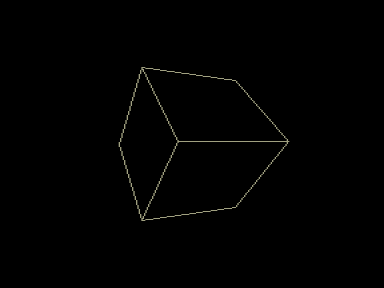

Вращение трехмерных фигур с удалением невидимых граней.

Вариант с автоматическим вращением.
Чем дольше жмете на клавишу, изменяющую угол, тем больше скорость вращения по данной оси.

Управление:

1. Вращение:

Курсор влево, вправо — изменение угла прецессии

Курсор вверх, вниз - изменение угла нутации

`F1`/`F2` или `↖`/`СТР` — изменение угла собственного вращения.
В emu и VV `↖` — Home.
В emu `СТР` — `Page Up`, в VV - `End`.
В онлайн-эмуляторе справа `F7`.

`ТАБ` — исходное положение (без изменения размера).
Для приведения в исходное положение с исходным (максимальным) размером можно использовать рестарт (`БЛК`+`СБР` на реале, `F12` в эмуляторах).

`ЗБ` (BackSpace в эмуляторах) - фиксирует текущее положение.

2. Изменение соотношения сторон:

`1` — (по умолчанию)  PAR=5:4 (если точнее, то 59:48) соответствует реалу. Из эмуляторов это соотношение сторон поддерживает Emu80.

`2` — PAR=1:1, т.е. без коррекции

3. Изменение размера - `F4`/`F5`

4. Выбор фигуры:

`4` — Куб

`5` — Пирамида

`6` — «Почти октаэдр»

`7` — Тетраэдр (в несколько неожиданном ракурсе)

