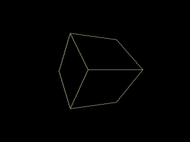

Вращение трехмерных фигур с удалением невидимых граней.

Вариант с автоматическим вращением.
Чем дольше жмете на клавишу, изменяющую угол, тем больше скорость вращения по данной оси.

Иван Городецкий

Версия 1.0 - 08.05.2018

Первый вариант.

Версия 1.1 - 09.05.2018

Изменены клавиши управления.

Теперь можно вращать по нескольким осям одновременно.

Версия 1.2 - 01.06.2018

Можно выбрать одну из четырех фигур.

Расширены пределы изменения скорости вращения.

Версия 1.3 - 02.08.2019

Расчет вращения ускорен практически в два раза. При большИх размерах фигур бОльшую часть времени занимают расчет проекции, отсечение невидимых граней, стирание и рисование, поэтому ускорение будет более заметно при меньших размерах фигур. При больших размерах фигур ускорение можно заметить при вращении по всем трем осям.

Убрал лишнюю задержку, связанную с кадровой синхронизацией, вместе с эффектом от предыдущего пункта ускорение видно невооруженным взглядом.

Увеличена точность расчета при отсечении невидимых граней. Это позволило уменьшить минимальный размер фигур без погрешностей в отсечении.

В связи с добавлением эмуляции вектора в Emu80 убрал один из вариантов коррекции сторон (4:3) и оставил только 5:4 (по умолчанию) и 1:1 (без коррекции). Клавиши переключения соответственно изменились. Убрал из архива конфиг для emu c 5:4.

Версия 1.4 - 19.08.2019

Еще сократил задержку ожидания кадровой синхронизации.

Использованы процедуры рисования линий и деления основанные на алгоритмах Николая Костулина (blackmirror)

Благодарности:

Вячеславу Славинскому (svofski) за старт данной темы и поддержку

Сергею Черкозьянову (KTSerg) за проверку на реале

Управление:

1. Вращение:

Курсор влево, вправо — изменение угла прецессии

Курсор вверх, вниз - изменение угла нутации

`F1`/`F2` или `↖`/`СТР` — изменение угла собственного вращения.
В emu и VV `↖` — Home.
В emu `СТР` — `Page Up`, в VV - `End`.
В онлайн-эмуляторе справа `F7`.

`ТАБ` — исходное положение (без изменения размера).
Для приведения в исходное положение с исходным (максимальным) размером можно использовать рестарт (`БЛК`+`СБР` на реале, `F12` в эмуляторах).

`ЗБ` (BackSpace в эмуляторах) - фиксирует текущее положение.

2. Изменение соотношения сторон:

`1` — (по умолчанию)  PAR=5:4 (если точнее, то 59:48) соответствует реалу. Из эмуляторов это соотношение сторон поддерживает Emu80.

`2` — PAR=1:1, т.е. без коррекции

3. Изменение размера - `F4`/`F5`

4. Выбор фигуры:

`4` — Куб

`5` — Пирамида

`6` — «Почти октаэдр»

`7` — Тетраэдр (в несколько неожиданном ракурсе)

