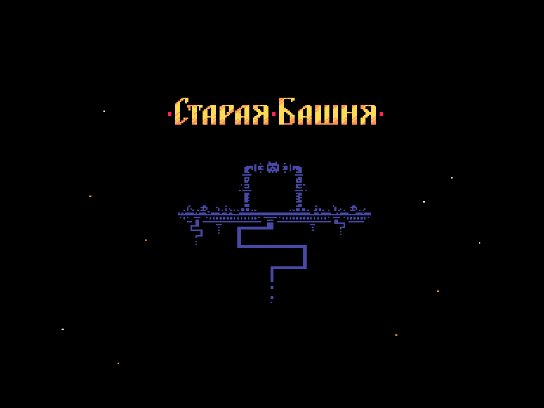
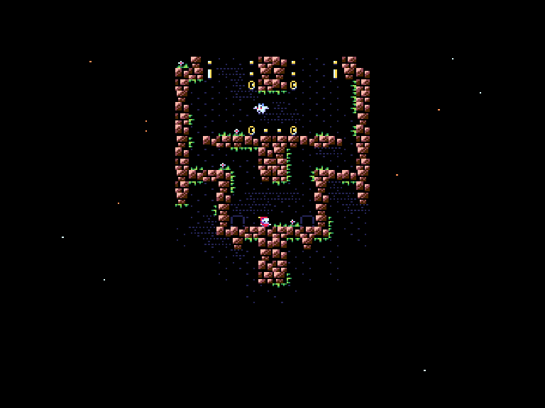

```
  ___  ____  __   ____   __   ____    ____   __   _ _   _  _  ____
 / __)(_  _)/ _\ (  _ \ / _\ / _  )  (  __) / _\ ( ) ))/ )( \/ _  )
( (__   )( /    \ ) __//    \\    \   ) _ \/    \/( ( \) __ (\    \
 \___) (__)\_/\_/(__)  \_/\_/(_/__/  (____/\_/\_/\____/\_)(_/(_/__/
```

В день когда звёзды начнут падать на землю откроется дверь Старой Башни, в заброшенных комнатах которой хранятся несметные богатства.

Будь осторожен путник, только храбрые сердцем и сильные духом смогут выбраться из Башни.

Наградой им будет людская слава и карманы полные золота!

## Управление

- Курсор - движение героя.
- Пробел - переключение между героями.
- ТАБ - рестарт уровня.

## Авторы

Игра: Денис Грачев.
Музыка: Олег Никитин.
Тестировал: Артёмка Васильев.

RetroSouls Team, сентябрь 2023.

Контакты: retrosouls@mail.ru, [retrosouls.net](https://www.retrosouls.net), [retrosouls.itch.io](https://retrosouls.itch.io/).

Исходники: [https://github.com/DenisGrachev/OldTowerVector06c](https://github.com/DenisGrachev/OldTowerVector06c)

Лицензия: [CC BY-NC-SA 4.0](LICENSE.md).



