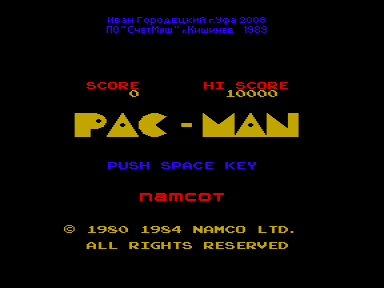
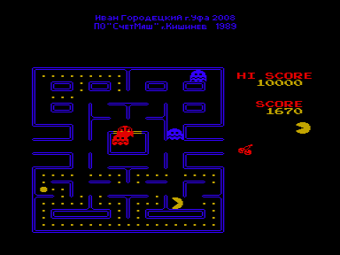

Данная игра является модификацией игры [Pacman](../pacman), адаптированной c MSX на ПО "СчетМаш" в 1989 году.

Были улучшены вывод звука и спрайтов:
1. Звук теперь выводится не через таймер, а через AY8910 в варианте Sound Tracker или R-Sound 2.
2. В данном варианте на экране одновременно могут присутствовать спрайты трех цветов, что ближе к версии на MSX. В версии "СчетМаша" спрайты одного цвета.

При работе игрушки используется квазидиск (проверка на пустоту не производится, поэтому часть содержимого КД может быть затерта).

Модификация была выполнена в январе 2001 года и доведена до ума в июле 2008 года.

Автор модификации - [Иван Городецкий](../../authors/ivagor)

