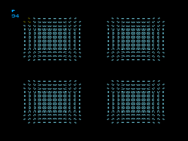
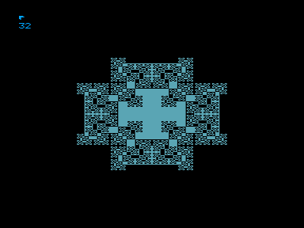

Клеточный автомат Parity.

Правило parity очень простое: клетка окрашивается, если число ее соседей нечетное, причем возможны шесть вариантов расположения соседей, определяющих состояние центральной клетки на следующем этапе.
Своим же соседом может считаться сама центральная клетка в нынешнем состоянии.

