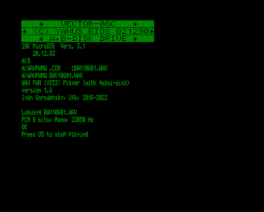

Проигрыватель wav-файлов (PCM, 8 бит, моно) с использованием таймера ВИ53.

Поддерживаемые частоты дискретизации:

8000 Гц (с линейной интерполяцией до 16000 Гц), 8-битное качество, громкость 3/3

11025 Гц (с линейной интерполяцией до 22050 Гц), 7-битное качество, громкость 2/3

16000 Гц, 8-битное качество, громкость 3/3

22050 Гц, 7-битное качество, громкость 2/3

wavpwmq - вариант для одного квазидиска, нужно использовать с МикроДОС 28.

wavpwm2q - вариант для двух квазидисков, можно использовать с большинством операционных систем. wav-файл загружается во второй квазидиск (порт 11h).

Имя wav-файла нужно указать при вызове в командной строке (можно без расширения .wav):

wavpwmq имяфайла.wav

или

wavpwm2q имяфайла.wav

[Иван Городецкий](../../authors/ivagor), 2016-2022

Версия 1.6 (29.11.2022)

Более корректная работа версии для двух квазидисков.

Изменена клавиша прекращения проигрывания с РУС/ЛАТ на УС.

