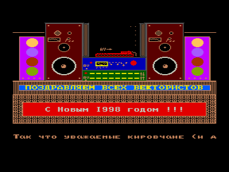

Душераздирающая история (см.[Кису](../kisa), затем [Care](../care)) получила свое продолжение.
Из данного демо мы узнаем, что просьба о помощи не осталась без ответа и в Ратчино появился второй Вектор.
Воспитанники BYK-а грудью встают на защиту своего руководителя от нападок кировских программистов и утверждают, что нынче пьют даже восьмикласницы.
Также по их словам у них «На каждую дубинку есть палка, а на дубинку &ndash; брено».
Что такое «брено», пока остается загадкой.
Посмотрев эту дему можно узнать еще очень много интересных деталей.

