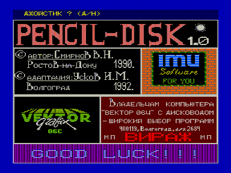
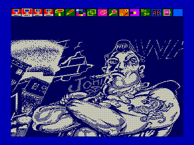

Данная программа представляет собой [графический редактор «Карандаш»](../karandash), адаптированный для работы с дисководом.

Редактор работает с файлами следующих форматов:

- упакованный формат экрана (файлы с расширением .PPP);
- формат фрагмента экрана (PUT/GET — файлы с расширением .GET);
- формат экранной плоскости, включённый специально для обработки файлов, полученных в COPY-640 (с расширением .SNC).

Для загрузки или выгрузки файла необходимо выбрать режим и на запрос имени файла набрать имя файла, заполняя пустые позиции пробелами до появления точки, после чего указать первый символ расширения (P, G или S).
Необходимо иметь в виду, что файл в формате *.PPP выгружается под именем, введённым последним, без запроса.

Редактор создаёт резервные копии файлов (аналогично MARGO) с расширениями .BPP и .BET.

Перед каждым сеансом обмена с диском редактор считывает каталог, таким образом можно менять дискеты в дисководе не опасаясь порчи каталога.

Редактор округляет размер выгружаемого файла до группы (2К), что можно считать недостатком.
Автор также приносит извинения за невысокую скорость обмена, буду рад, если кто-нибудь подскажет как её увеличить.

Замечания и предложения направляйте по адресу:

400119, Волгоград, а/я 2684, мп «Вираж».

Желаю успеха!

5.09.92г.

Усков И.

