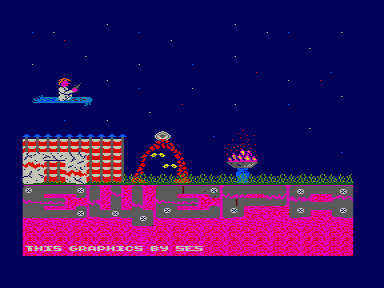
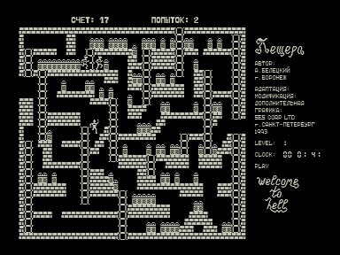

Адаптация игры «[Пещера](../pescher1)» с интро от S.E.S.
По графике напоминает версию с УКНЦ.
Используется режим графики высокого разрешения 512x256.

Управляя человечком, нужно, спасаясь от чертей, собрать все клады на каждом этапе.

| Клавиша | Действие |
| - | - |
| ТАБ | стрельба влево |
| ПС | стрельба вправо |
| ЗБ | выбор фона игры |

См. также: [Пещера](../pescher1), [Клад](../klad).

