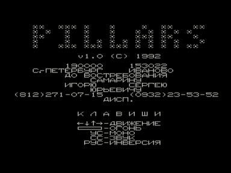
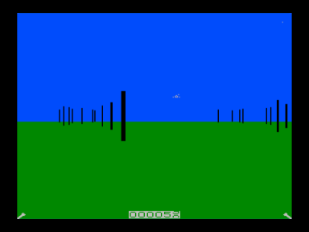

Это интересно: файл игры зашифрован по оригинальному алгоритму, в котором производится вычисление адреса перехода с использованием текущего состояния регистра флагов.
Игра появилась в электронной копии в 2000 году и в течение 9 лет ни один эмулятор не позволял запустить ее.
Усилиями энтузиастов с форума zx.pk.ru ([Ramiros](../../authors/ramiros), [ivagor](../../authors/ivagor), [Tim0xA](../../authors/timoshenko)) в марте 2009 года была найдена причина неудач.
Она была связана с неверной обработкой флага дополнительного переноса AC в команде вычитания SUB.
Авторы-эмуляторщики с завидным упорством повторяли эту ошибку в эмуляции процессора КР580ВМ80А более 10 лет.

