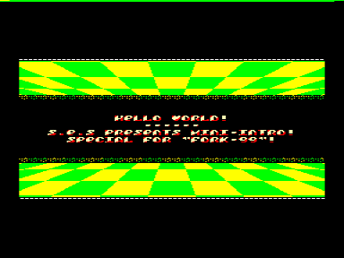

# Полёт Навигатора

4К интро для Fork-99.

## Титры

| | |
|---|---|
| Код, графика, адаптация музыки | S.E.S |
| Музыка | DOC |
| Помощь | Masterpiece |
| Объем запакованной проги | 4096 байт |
| Объем распакованной проги | примерно 7424 байт |

## От автора

В этом небольшом, сопровождающем интру, текстике хочется сказать пару слов.
Сначала несколько слов о данной работе.
Летящее «шахматное» поле - это, в отличие от моей демы «Fly», Real-Time, но не флики.
Эффект, конечно, очень простенький, ну да ладно.
Музон написан в формате редактора «Sound Tracker».
Версия плеера адаптирована мной, т.е. это не вариант плеера Саттарова.
Запаковано все это дело на «Sprinter»-е, упаковщиком «Hrust v1.1», депакер которого я кое-как адаптировал на «Вектор».

Почему «Полет Навигатора»? Не знаю.
Летит кто-то куда-то, потому так и назвал.

Хочется сказать несколько слов участникам и болельщикам, буде таковые изыщатся: не важно, сколько человек участвует, не важно, кто займет первое место - важно совсем не это.
Важно то, что кто-то что-то делает в этом жанре и вообще есть какое-то движение!
Можно бесконечно долго и нудно, до хрипоты, рассуждать о том, что, мол, никто ничего не делает и т.д. и т.п.
Можно, конечно... А можно делать и рассуждать иначе: «Что значит „никто ничего не делает“? А я?».
Как говорится, от рассуждений чего-то там не прибавится (поговорка).
Можно рассуждать, спорить, а можно делать и знать, что что-то кто-то точно делает и это не треп и не слухи, ибо этот кто-то - ты сам!
Можно переливать из пустого в порожнее и кричать, что, мол, сцена загибается, а можно что-то делать и недоуменно замечать на такие крики: «Что, как это она может загнуться - я же здесь!».

Может быть, «Полет Навигатора» - это не случайное название, может, есть в этом скрытый смысл.
Может, это хитрое подсознание извлекло на свет это название полузабытого фильма, как символ некоего движения вперед, ибо кто летит, тот не стоит и уж, тем более, не ползет.
Некоторые, может быть, могут ползать, а может быть и нет, а может быть, все и не так, а иначе...
Кто знает...

S.E.S

## Ссылки

- https://www.pouet.net/prod.php?which=51956
- Soundtrack: DOCZak1 by DOC'NEONSOFT https://zxart.ee/spa/autores/d/doc/doczak01/
