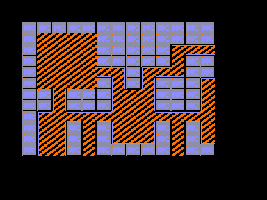

Sprite level renderers by PPC (c) 2011

(Tehnology demonstrators)

FBSP.COM contains 2 different renderers in one application:

Renderer with orange-colored levels uses per-plane-contolled sprite placement.

Two planes (of maximum 4) are used by this renderer in the demo.

Renderer with red-colored levels uses frame-buffered output.

Two planes (of maximum 2) are used by this renderer.

Run fbsp.com under MicroDOS.

File level001.map is required: it contains rendered level.

KEYS:
Space: switch between renderers

Arrows: level scrolling

Plus key: render level at full screen mode

Use arrow keys to see rendition. Most vivid difference of rendering is apparent in this mode.

Minus key: render level in viewport

ESC (AP2): exit to MicroDOS

Enjoy! *8-)

-PPC-

