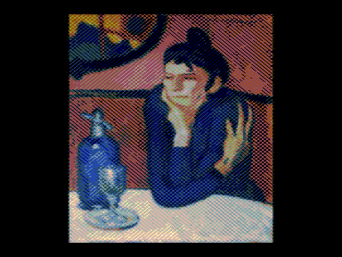

Прогрессивный показ полноцветных изображений с музыкой на Векторе-06ц без расширений.

Makes 16-colour 256x256 pictures appear progressively starting with large 8x8 blocks, then adding progressive refinements.

Plays music on builtin 8253 PIT.

Features interesting, potentially reusable bits of code for Vector-06c and possibly for 8080 in general:

 * streaming dzx0 unpacker
 * gigachad16 AY register player
 * AYVI53 realtime AY emulation on 8253 PIT

https://github.com/svofski/v06c-progdemo

См. также [Эмулятор AY-3-8910 на КР580ВИ53](../ay_emulator).

