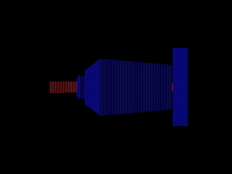

3D-рейкастер для Вектора-06ц и ПК-6128Ц.
Запускается в автоматическом режиме.
После нажатия любой кнопки управляется стрелками.

Варианты для разных компьютеров и процессоров:
- rc46.rom — Вектор-06ц 8.6 FPS (2020)
- rc44.rom — Вектор-06ц 8.2 FPS (2019)
- rc38.rom — Вектор-06ц 8.0 FPS
- rc38vm1.rom — Вектор-06ц с процессором 580вм1
- rc3885.rom — ПК-6128Ц с процессором ИМ1821ВМ85А (8085) 11 цветов, 8.3 FPS
- rc3885f.rom — ПК-6128Ц, ускоренная версия 6 цветов, 9.3 FPS

