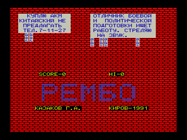
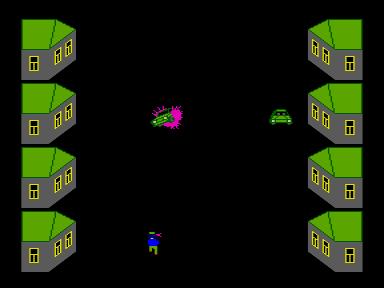

Дикий 1991-й год, перестройка, разруха на улицах и в головах.
Улицы и газеты полны объявлениями купле-продаже автоматов Калашникова и ручных гранат&#133;

На территории села неподалеку от Кирова произошел спор двух торгующих программным обеспечением кооперативов.
Кооператив «Пупкин и Ко.» торгует ПО без лицензии, имеет много денег, крутых тачек и серьезных ребят.
Кооператив «ЧП Дыркин»  пытается работать честно, платит налоги государству и серьезным ребятам Пупкина и при этом пытается отчислять проценты с продаж авторам.
Из-за этого у него нет ни машины, ни вообще ничего.
Казалось бы, безнадежная для Дыркина ситуация.

Но однажды, узнав о кознях Пупкина, из далекой Америки прилетает двоюродный брат Дыркина Рэмбо &ndash; спортсмен, кавалер значка ГТО, защитник демократии и интеллектуальной собственности во всем мире и просто хороший парень.
В этот день в отношениях Пупкина и Дыркина наступает переломный момент&#133;

