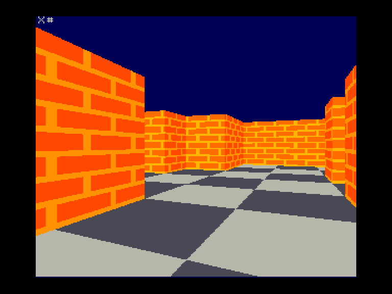

Участник конкурса программ на Бейсике для Вектора-06ц [«РЕТРОГРАД»](./..) в категории «Демо».

Процедурно генерируемые картинки.

Адаптировал с BBC Micro (автор Paul Malin) рейкастер с текстурированием

[https://bbcmic.ro/?t=9dcqv](https://bbcmic.ro/?t=9dcqv)

Оптимизировал изо всех сил, но подождать придется.

Время исполнения для Вектора:

rctxt06c:

В 2.993 - 4 минуты 21 секунда

В 2.5 - 11 минут 45 секунд

-------------------

Чёрно-белая версия для специалиста.
Работает в бейсике-практик и скорее всего в расширенном бейсике Волкова тоже.

