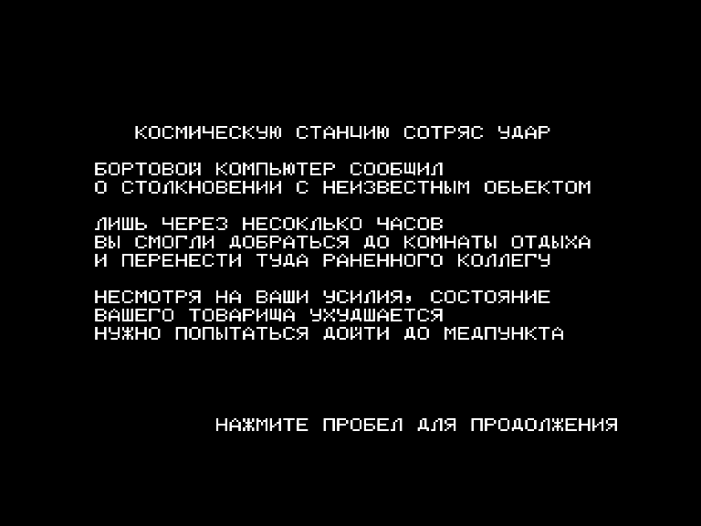
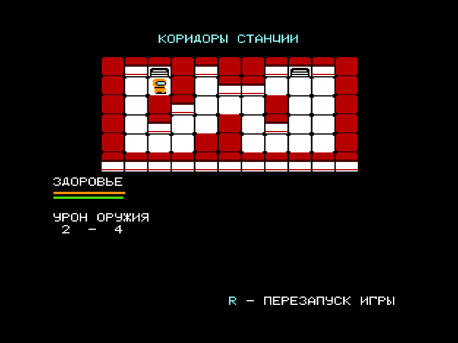

Участник конкурса программ на Бейсике для Вектора-06ц «РЕТРОГРАД» в категории «Игры».

Играем за сотрудника космической станции, в которую ударился объект неизвестной природы.

Стартуем в комнате отдыха, куда смогли оттащить раненого коллегу.
Наша задача – спастись самому дойдя до спасательных капсул (комната с красной дверью).
По возможности таже нужно попытаться спасти товарища, принеся ему лекарство из мед.отсека.

По пути на нас нападают зараженные космонавты.
Мы можем улучшать наше оружие, собирая усилители с ящиков на стенах, а также лечиться у аптечек.
С помощью аптечек мы не только восстанавливаем здоровье, но и получаем медицинскую капсулу, которой можем лечить нашего коллегу, возвращаясь к нему с капсулой.
Чем из более дальней комнаты мы приносим капсулу, тем более долгий терапевтический эффект.

В начале геймплея много времени занимает генерация коридоров станции.
Перемещаемся по коридорам с помощью стрелок.
Если на нас нападает зараженный, то атакуем пробелом, а во время атаки противника, можем выбирать подпрыгнуть или присесть.
Так есть шанс избежать урона.

Подбираем оружие или лечимся, просто нажимая стрелку в сторону аптечки или заряда.

Файлы в архиве:

SpaceSt5_raw.bas – исходный файл с комментариями для преобразования в бейсиковский с номерами строк

SpaceSt5.bas – файл на бейсике для Вектора

SpaceSt5.cas – кассетный загружаемый файл игры

SpaceStVars.dat – описание переменных в игре

Авторская версия совместима с Бейсик 2.5. В архиве также лежит доработанная версия SpaceSt5U, совместимая с Бейсиком 2.993.

