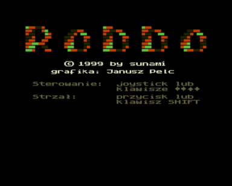
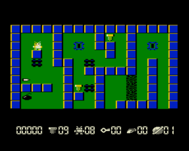

Версия Robbo от Алексея Нагаева.

Это последняя игра Алексея «sunami» Нагаева, которая не вышла в свет при жизни автора.
В картотеке она появилась благодаря другу Алексея [Андрею Каргину / Kan Soft](../../authors/kansoft).
Большое спасибо, Андрей!

"Дарю вам последнюю не вышедшую игрушку Нагаева Алексея ROBBO.
Полная копия игры с атари 5200.
За проходимость уровней не ручаюсь.
Сам играл чуток, но Алексей в свое время говорил, Что все уровни сдернуты с атари один в один.
Даже рисовать ничего не пришлось.
Просто выдрали блок уровней из версии для атари.
Про количество их мне не известно, но по слухам на атари их не меньше 60"

Игре нужен квазидиск.
Звук выводится через AY.

Управление:

стрелки курсора перемещают главного героя

УС + &uarr; &darr; &larr; &rarr; — стрельба в соответствующем направлении. (при наличии патронов разумеется)

ЗБ — начать заново

