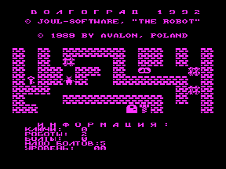

Робот бродит по лабиринту и собирает болты, чтобы починить себе мозг. В лабиринте есть передвижные блоки, которые могут навсегда заблокировать путь, двери и ключи к ним и злые роботы у которых не осталось уже ни одного болта.

Януш Пельц указан как автор идеи и оригинальной игры на Атари и к разработке программы для Вектора непосредственного отношения не имеет.

Про Роббо на Атари: [http://www.toster.ru/275/](http://www.toster.ru/275/)

См. также [другие версии](../).

