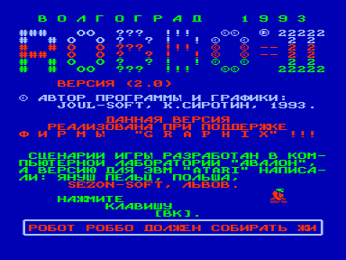
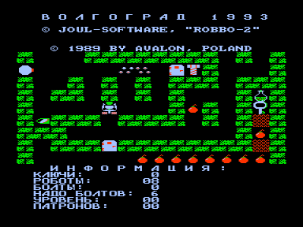

«Робот Роббо должен собирать жизни в колбах и ключи, которыми можно открывать двери. Собрав заданное количество болтов, Роббо получает право выйти на следующий уровень через мигающую тарелку. Взяв пулю, робот может стрелять, освобождая себе проход и защищаясь от врагов. У Роббо есть злые враги — птички, глазки, чертики и пушки, которые изредка могут и помочь ».

Януш Пельц указан как автор идеи и оригинальной игры на Атари и к разработке программы для Вектора непосредственного отношения не имеет.

Про Роббо на Атари: [http://www.toster.ru/275/](http://www.toster.ru/275/)

См. также [другие версии](../).

