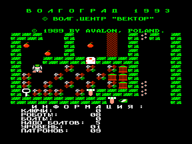

Третья игра про робота Роббо, который мечтает собрать себе настоящий железный мозг. Автор игры сообщает, что такой версии игры он не делал и, по всей видимости, эта версия является бутлегом.

Януш Пельц указан как автор идеи и оригинальной игры на Атари и к разработке программы для Вектора непосредственного отношения не имеет.

Про Роббо на Атари: [http://www.toster.ru/275/](http://www.toster.ru/275/)

Управление:

&larr;&uarr;&darr;&rarr; &ndash; перемещение, РУС/ЛАТ+&larr;&uarr;&darr;&rarr; &ndash; стрельба

См. также [другие версии](../).

