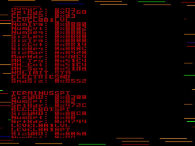
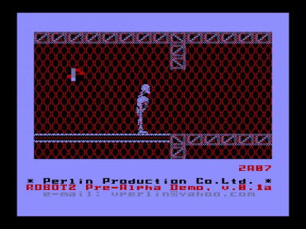

От разработчика:

Всем привет !

Пришло время первого релиза, как я и обещал.
Это ещё очень и очень и очень сырая Pre-Alpha, но уже вполне демонстрирует возможности движка и направление куда я собираюсь двигаться.
На спрайты особо не смотрите, они — не для красот, а для тестов альфа-канала.
В будущем, надеюсь, все будет получше.
А пока — принимайте первый билд.
Следующий public release будет уже альфа, и этот релиз будет ещё очень не скоро.
Планов-громадьё, а времени — совсем нет.

Да, там ещё на диске пару-тройку goodies можно найти.
Это-для любознательных.
Сорцы, development toolkit и утилиты выложу попозже.

— PPC

Источник: [http://zx.pk.ru/showthread.php?t=19922](http://zx.pk.ru/showthread.php?t=19922)

