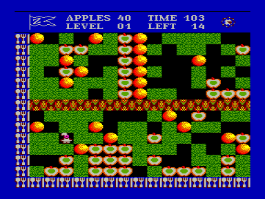
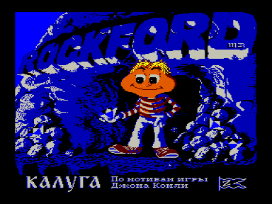

Rockford по мотивам игры Джона Конли

Наиболее удачная версия игры из серии «Boulder Dash». Она адаптирована с компьютера IBM. Игрушка отличается от других аналогичных ей тем, что она имеет превосходную графику, быстроту движений, отличный звук, что делает ее интересной и не надоедливой. В игре вы управляете маленьким поваренком, который должен собрать определенное количество яблок на каждом уровне игры. В начале вы имеете пятнадцать жизней, за каждый пройденный уровень вам прибавляется еще одна. Дойти же до последнего уровня довольно сложно. 

В игре имеется возможность смены уровня, для этого нужно нажать клавиши УС+СС+РУС/ЛАТ. При этом вам прибавится очередная жизнь и вы окажетесь на следущем уровне. Но будье внимательны &ndash; уровней всего десять. При нажатии на клавишу ВК игра переходит в режим ожидания и ждет пока не будут нажаты клавишы: F1 — «продолжить», или F2 — «переиграть».

