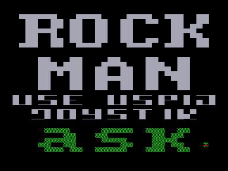
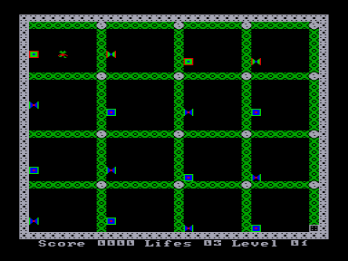

Управляя человечком и собирая алмазы, нужно пройти 31 этаж.
Во время игры вам будут мешать «жители» этажей — бабочки, шарики, квадраты.
При столкновении с ними вы взрываетесь и теряете жизнь.

Вот основные элементы этажа:
1. Зеленая стенка: человечек может пройти через нее, а «жители этажей» — нет. Там, где человечек прошел, стенка исчезает.
2. Камни: человечек может двигать один камень нажатием клавиш `ЗБ`+`/`. Если камень находится на краю, то он падает. Если человечек стоит под падающим камнем, то он погибает, как и все другие «жители этажа».
3. Алмазы: с их помощью человечек набирает очки. Один алмаз — одно очко.
4. Красная стенка непроходима для человека. Но, если камень упадет на «жителя этажа», находящегося около стенки, то «житель» взрывается, после чего часть стены рядом с ним пропадает.
5. Мигающая стенка: проходя через нее камни превращаются в алмазы, а алмазы — в камни.
6. Разрастающаяся стенка: через некоторое время, если она огорожена со всех сторон камнями или стенками (кроме зеленой), она превращается в алмазы. Если не огорожена — в камни.
7. Выход на следующий этаж (похож на игральный кубик) открывается после мерцания фона.

Жители этажа:
1. Квадрат — двигается по периметру свободного пространства.
2. Бабочка — передвигается, как квадрат.
3. Шарик — передвигается в произвольном направлении, отскакивая от препятствий.

При попадании камня (алмаза) в бабочку или шарик, они превращаются в 9 алмазов.

В этой игре есть редактор этажей. Вход в него осуществляется из заставки нажатием клавиш `УС`+`СС`+`РУС/ЛАТ`.
Перемещения курсора производится стрелками.
Выбор элемента этажа производится нажатием клавиш `ЗБ`+`&larr;`/`&rarr;`.
Нажимая несколько раз эти клавиши, вы можете выбирать любой элемент этажа.
Сставятся элементы нажатием клавиши `ЗБ`.
Переход на следующий этаж: `ЗБ`+`&uarr;`/`&darr;`.
Стрелка вверх листает этажи назад, стрелка вниз — вперед.

Выход из редактора или игры — `РУС/ЛАТ`.
Во время игры есть возможность смены этажа с помощью клавиш `УС`+`РУС/ЛАТ`.

См. серия [Rock Man](..).

