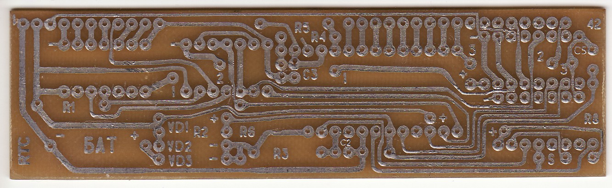
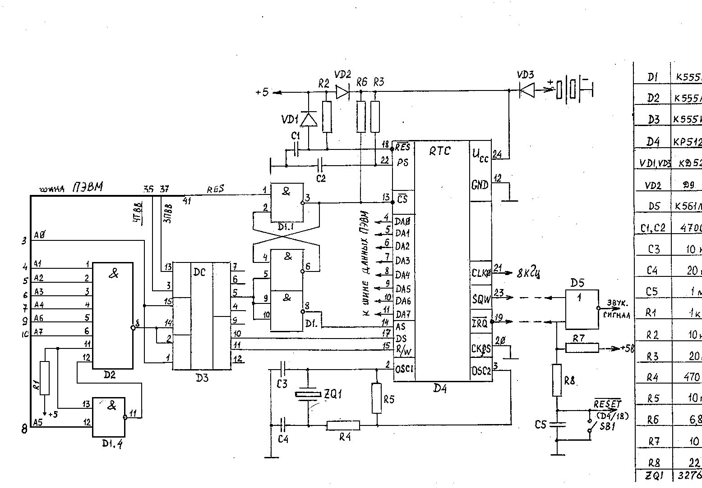

Часы реального времени (RTC) собраны на специализированной микросхеме КР512ВИ1.
Эта микросхема имеет режим календаря, часов и будильника, а также ОЗУ общего назначения 50 байт.

RTC поддерживается в ОС [DOS201](../dos201) и в Эмулятор «Башкирия-2М».

Фото из архива Виктора Фиронова.

