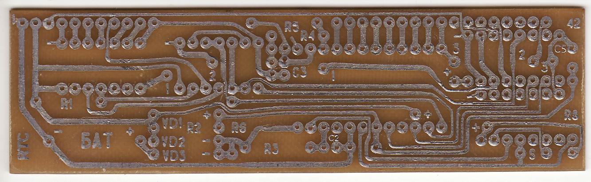
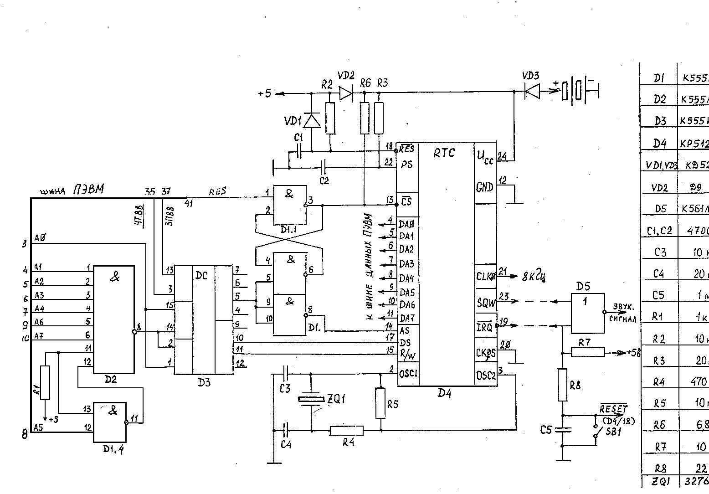

Часы реального времени (RTC) собраны на специализированной микросхеме КР512ВИ1.
Эта микросхема имеет режим календаря, часов и будильника, а также ОЗУ общего назначения 50 байт.

RTC поддерживается в ОС [DOS201](../dos201) и в Эмулятор «Башкирия-2М».

Документация:

- **[Системные часы реального времени](rtc_omsk1.md)** - описание платы, программирование через порты 20H/21H, регистры A-D.
- **[Часы реального времени](rtc_omsk2.md)** - второй вариант того же описания (41-контактная плата, схема звукового сигнала на R8C5).

Оригиналы текстов в кодировке CP866 - [rtc_omsk.7z](rtc_omsk.7z).
При переводе в Markdown исправлены очевидные опечатки оригинала.

Фото из архива Виктора Фиронова.

