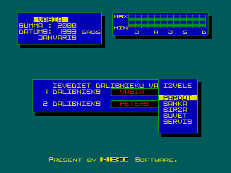

Бизнес-игра на Латышском языке.
Это экономическая игра, демонстрирующая оконный режим работы компьютера.
Целью игры может быть: строительство дома, или определенная сумма заработанных денег, или определенный срок игры.

Архив содержит описание игры из журнала «Vector &amp; Krista World».

