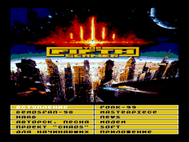

Электронный выпуск журнала «Сканер» №5.
Судя по всему, предыдущие четыре выпуска выходили на бумаге, а этот номер оказался последним.
В состав журнала входит приложение из нескольких программ: [Best+](../best_plus), [Zas](../zas), [Polet4K](../polet4k), [NeoSpiral](../neo_spiral), [digital](../digital), [df99info](..df99info).

Содержит отчет о проведении [DemosFan ’98](../demosfan/1998).

