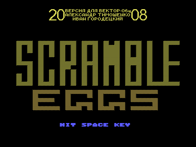
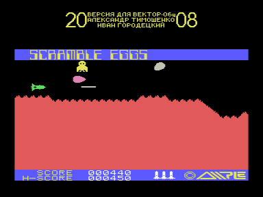

Игра SCRAMBLED EGGS адаптирована с MSX.
Для запуска нужен обычный Вектор с КР580, квазидиск не требуется.
Звук выводится через Sound Tracker или R-Sound 2.

Космический корабль летит над красными горами, вероятно действие происходит на Марсе.
Непонятно откуда на Марсе появились летающие яйца.
Из белых нужно добывать бластером птенцов, а сиреневые не пробивает даже бластер, от столкновения с ними нужно уклоняться.

Управление в игре - курсор вверх-вниз и пробел.

Авторы адаптации:
- Рекомпиляция игры с z80 на КР580 - [Александр Тимошенко](../../authors/timsoft), г. Чернигов, Украина, timsoft@mail.ru, vector06c.narod.ru
- Эмуляция MSX BIOS и железа MSX на Векторе - [Иван Городецкий](../../authors/ivagor)

Версия 1.0 - 26.09.2008

