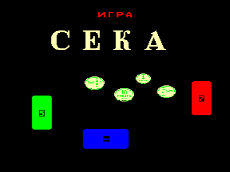
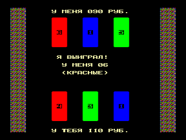

Полностью автоматизированная азартная игра, надо только нажимать пробел.

# История из интродукции:

(из темноты летит допитая бутылка)

## Диалог

— Фу, скука.. Чем займемся?

— А черт его знает…

— И водка кончилась…

— Да, жаль…

— А пошли в казино, повеселимся!

— Да кто нас туда пустит?!

— Эх, поиграть хочется…

— Поиграть можно и не в рулетку.

— А во что можно играть на бабки?

— Да хоть во что, хоть в карты…

— Но у нас нет карт.

— Зато есть цветная бумага…

— Ну и что с ней делать?

— А вот щас нарежу и нарисую…

— И что это за игра такая?

— Очень простая, — „Сека“!

— Ну что ж, сыграем?

— Улыбнись, фортуна!

Игра представлялась на [Fork ’99](../fork99)

