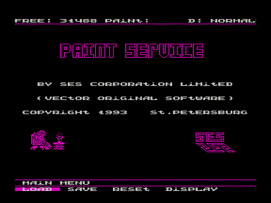
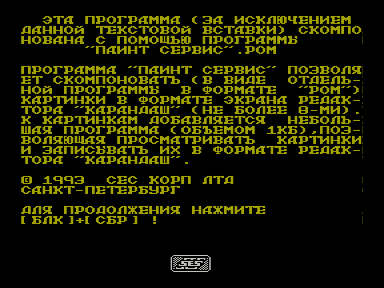

Программа «Пэйнт Сервис» позволяет скомпоновать в виде программы в файле .rom картинки в формате экрана редактора [«Карандаш»](../karandash), но не более восьми сразу.
К картинкам добавляется небольшая программа объемом 1 Кб, позволяющая просматривать изображения и записывать их в формате «Карандаша».

