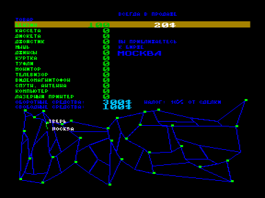
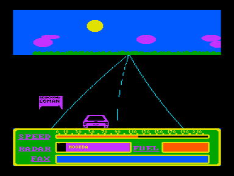

«Правила: покупай, продавай, обгоняй, ОБМАНЫВАЙ.

После последнего биржевого краха у вас остались машина и несколько далларов в кармане, но надежда разбагатеть не покинула вас»… (орфография сохранена).

Нетривиальная деловая игра.
Действие разворачивается на территории бывшего СССР в ревущие девяностые.
Между населенными пунктами играющий передвигается на автомобиле, где можно обгонять.
В узловых точках, «биржах», происходит торговля, где можно покупать, продавать и обманывать.
По принципу игры напоминает Elite.

Распространялась кооперативом COMAN.

В два вaрианта:

shoptour.rom - не работает на Z80, но есть оригинальная заставка COMAN

shopt.rom - работает на любом процессоре, но нет заставки

Управление в игре:

Курсор - управление автомобилем

Пробел - карта и прайсы

CC+стрелки - купля-продажа

Стрелка влево-вверх - разворот

