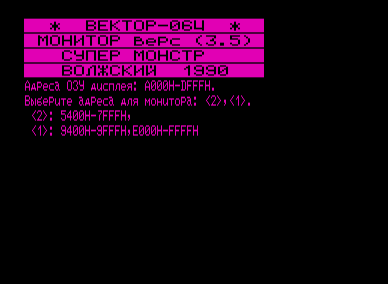
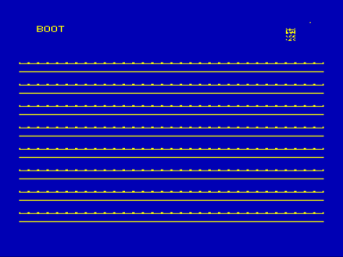

Данная версия монитора отличается от стандартной наличием двух дополнительных команд (выбрать режим 3 при запуске):

B — загрузка файла в ROM-формате с 1-го блока.

BM — загрузка файла в ROM-формате с 0-го блока со смещением на 1 блок.

В архиве несколько версий: плагиатские, упакованные, с различными дисковыми адаптерами.

См.также [Ассемблер-редактор v1.4](../../edasm),[Monitor «HIGH»+EDASM](../../monhedm)

