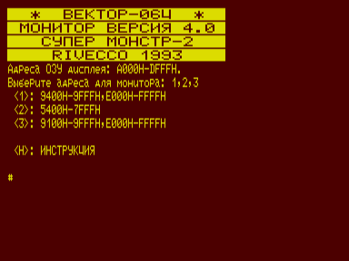

Директивы монитора в режимах 1 и 2 не отличаются от базовой версии монитора-отладчика.
В режиме 3 существуют две дополнительные директивы J и K.

Директива J предназначена для очистки экрана. Она аналогична команде «К+ВК+СТР+F4» монитора и команде CLS бейсика.

Директива Y предназначена для определения константы чтения программ с магнитой ленты.
По этой директиве можно определить константу для программ, записанных в любом формате.
для определения константы записи нажно разделить константу чтения на 1.5

P.S. Директивы J и Y не имеют никаких параметров.

