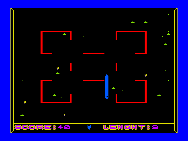

Гуманная игра. Травоядный питон поедает цветы, избегая встреч с канцелярскими кнопками и преградами. Это вторая версия первой авторской игры в кодах, написанной на [LS-Pascal](../../lspascal). Была прикручена музыка в заставке и в конце игры, добавлены преграды. Ее купил центр «Компьютер» (Кишинев) за 400 рублей. «Вектор-06Ц» стоил тогда 750 рублей.

См. также [Snake 1](../1), [Snake 3](../3).

