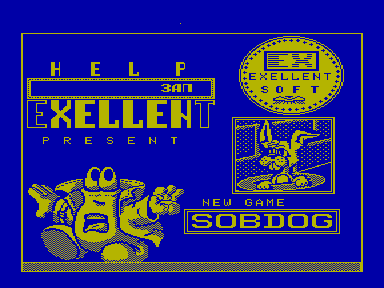
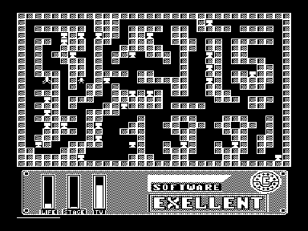

Игра СОБДОГ (Собиралка-догонялка).
Суть игры - собрать телевизоры в лабиринте.
Творение похоже на пробу пера начинающего программиста.
Более-менее нормально запускается в [Эмулятор «Virtual Vector»](../virtual_vector), если принудительно установить режим 256x256.
Представляет исключительно коллекционный интерес.

Элементы заставки позаимствованы из игры ZX-Spectrum «Humphrey» [http://www.worldofspectrum.org/infoseekid.cgi?id=0002378](http://www.worldofspectrum.org/infoseekid.cgi?id=0002378)

