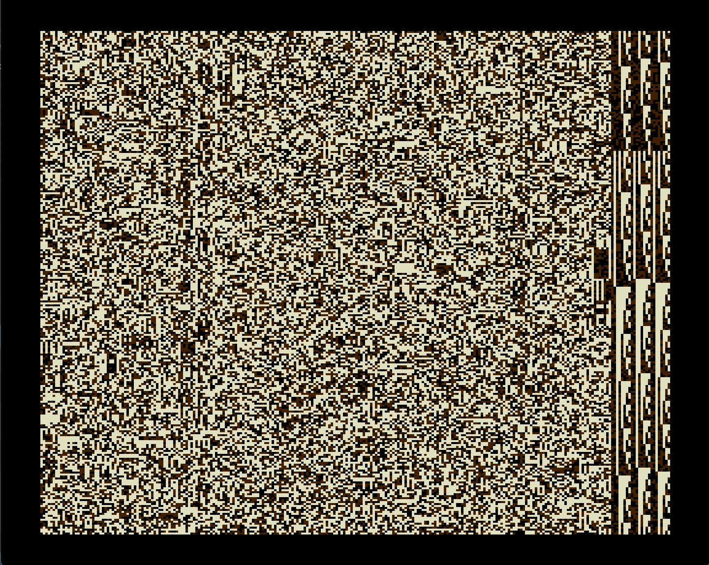

Исходный фрагмент: 22.6 секунды, частота дискретизации 22 кГц, 8 бит/отсчет.

Без сжатия он занял бы 485.5 килобайт, т.е. не поместился бы в кваз.
А тут удалось запихнуть в голый вектор.
Сжатие в рабочем (без эксомизера) состоянии почти в 8 раз.
Правда из-за технических ограничений вектора пришлось чуть придушить битность до 7.585 бит/отсчет (воспроизведение через ВИ53).
Файл упакован эксомизером, но все равно слишком большой для обычного загрузчика, поэтому для реала подойдет hm22trip.wav с автостартующим быстрогрузом.
Загружается, стартуем, ждем пока распакуется (по экрану пройдет волна), слушаем.

Клавиши управления: `CC` - пауза, `УС` - продолжить после остановки или воспроизвести с начала после окончания.

Воспроизведение с начала в любой момент: `БЛК`+`СБР`.

