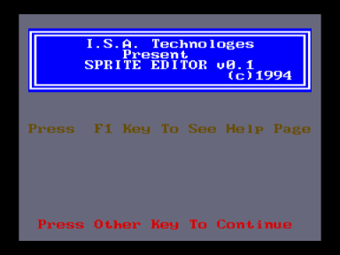
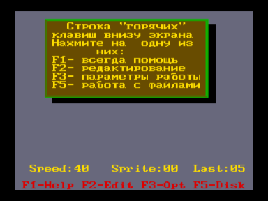

Программа для создания четырехцветных движущихся спрайтов.

От разработчика:

"Исходники компилятся и линкуются в готовую прогу, правда в КОИ-7 из-за того, что так работает m80, сбрасывая у всех data declarations старший бит.
Похоже, что m80 мы захакали когда-то, и он у нас работал в КОИ-8, но как мы его захакали сейчас уже и не вспомнить."

Источник: [zx-pk](http://zx-pk.ru/showpost.php?p=536472)

