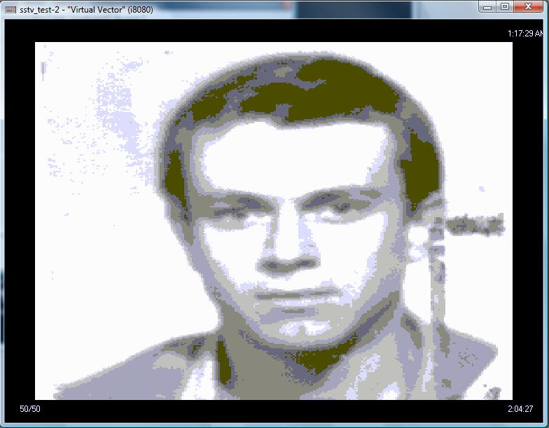
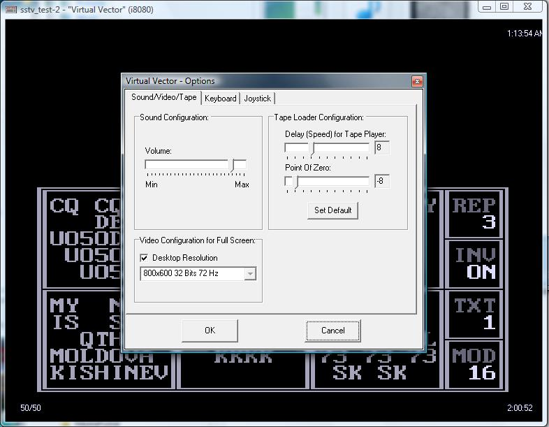

Программа для работы SSTV (медленное телевидение) предназначена для радиолюбителей-коротковолновиков, желающих освоить новый вид цифровой связи, позволяющий передавать и принимать изображения по обычным каналам радиосвязи.
Позволяет принимать картинки через магнитофонный вход.

Возможности программы:

— 8 градаций яркости

— время полной развертки кадра 8,16,32 секунд

— одновременная подготовка текста с передачей

— возможность использования картинок подготовленных в [Карандаше](../karandash)

— поддержка диска

— редактирование графики

— запись принятых картинок на диск

Управляющие клавиши:

СС+R прием

СС+T передача текста

СС+F передача файла (см файлы SCR)

СС+F1 8 сек

СС+F2 16 сек

СС+F3 32 сек

СС очистка экрана и принудительная синхронизация

Для запуска в эмуляторе VV установить опции Tape Loader Configuration: Delay=8, Point of Zero=&ndash;8

В архиве представлены примеры WAV-файлов SSTV, статья из журнала Радиолюбитель №7 за 1995 г. и скриншоты.
Загрузочный образ диска содержит две версии программы (полная и Receiver only).

