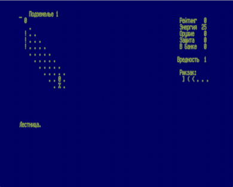

Исходник игры получен реверс-инжинирингом бинарника STALK1.SAV для RT-11.
Игра сконвертирована для сборки компилятором MT-Pascal.

Автор игры неизвестен.

Автор реверса [Никита Зимин](../../authors/nzeemin).

Исходник этой версии и инструкция для сборки:

[https://gist.github.com/svofski/c2aae20e1180aec73e0201ffa347e3cf](https://gist.github.com/svofski/c2aae20e1180aec73e0201ffa347e3cf)

Запускать из МикроДОС.
Управление цифровыми клавишами на дополнительной клавиатуре, которой у Вектора нет, поэтому игра еще интереснее.

