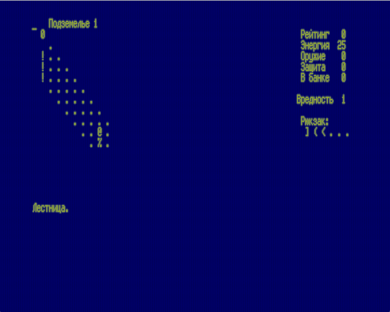

Исходник игры получен реверс-инжинирингом бинарника STALK1.SAV для RT-11.
Игра сконвертирована для сборки компилятором MT-Pascal.

Автор игры неизвестен.

Автор реверса [Никита Зимин](../../authors/nzeemin).

Исходник этой версии и инструкция для сборки: [https://gist.github.com/svofski/c2aae20e1180aec73e0201ffa347e3cf](https://gist.github.com/svofski/c2aae20e1180aec73e0201ffa347e3cf)
## Сборка
```bash
set -e

if [ "$1" == "prn" ] ; then
    opt='$PA X'
fi

rm -f stalk1.com stalk1.erl stalk1.prn stalk1.dis

../../cpm/cpm mtplus stalk1.pas "$opt"
../../cpm/cpm linkmt stalk1,paslib/s/d:8000/m
ls -l stalk1.com
mkdir -p fdd

if [ "$1" == "prn" ] ; then
  ../../cpm/cpm dis8080 stalk1 >stalk1.dis
fi

cp stalk1.* fdd/

# listing + disasm
#../../cpm/cpm mtplus stalk1.pas '$PA X'
#../../cpm/cpm dis8080 stalk1 >stalk1.dis
```

Запускать из МикроДОС.

Управление цифровыми клавишами на дополнительной клавиатуре, которой у Вектора нет, поэтому игра еще интереснее.


