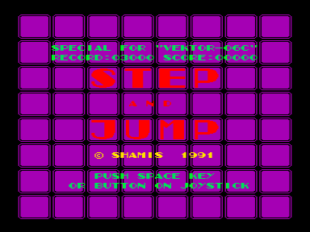
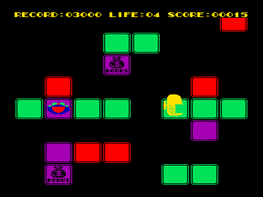

Очень динамичная игра. Использует аппаратный скроллинг. В игре, управляя человечком и перепрыгивая с квадрата на квадрат, нужно дойти до конца уровня. Всего уровней 15. Если же человечек на краю квадрата или над пропастью, то он погибает. Прыгать человечек может через один квадрат. На некоторых квадратах есть рисунок и надпись. Вот их обозначения:

D E A T H — если сюда ступить, то человечек погибнет

S P E E D — увеличивается скорость передвижения

B O N U S — прибавляется 10 очков

J U M P — Вы можете один раз перепрыгнуть на неограниченное расстояние (в пределах экрана) до первого попавшегося квадрата. Если же не встретится ни одного квадрата, то человечек погибает.

L I F E — прибавляется одна жизнь

F L Y — смена уровня

S T A G E  E N D — конец уровня

За взятие любого такого квадрата, кроме STAGE END, еще прибавляется 5 очков. По экрану иногда движется монстр, который может убить, столкнувшись с Вами. За проход одного уровня прибавляется 514 очков. Одновременное нажатие клавиш S+Т (когда картинка еще не двигается) — смена уровня.

