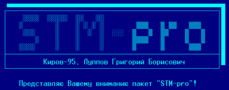

# STM-PRO

Киров-95, Луппов Григорий.

Представляю Вашему вниманию пакет «STM-pro»!



## Введение

Плата музыкального сопроцессора для «Вектора-06Ц» была создана в 1993 году Виктором Саттаровым и, как часто бывает со многими разработками, пролежала год без движения.
Лишь летом 1994 года началась рекламная компания «Sound Tracker-а» центром «Байт» и более-менее массовые продажи этого простого и очень впечатляющего устройства.
Вся конструкция платы продумывалась с целью максимально точно воспроизвести музыкальные файлы, адаптированные со «Спектрума».
Это позволило достичь программной совместимости путем простого копирования STM-файлов со «Спектрума» и проигрывания их на стандартном player-е, кроме того это позволило решить проблему программной поддержки на первый момент.

Надо сказать, что идея музыкальной платы витала в воздухе.
На разработчиков оказывал сильное влияние «Спектрум» со своими музыкалками.
Летом 1994 года Руслан Костиневич (Беларусь) создал свой вариант платы «R-Sound».
Плата подключалась к порту «ПУ» и была не совсем совместима со спектрумовскими STM-файлами из-за не соответствия тактовой частоты (1.5 Мгц вместо 1.77 Мгц).
Позднее Руслан модернизировал свою разработку до полной аппаратной совместимости и назвал ее «R-Sound-2».
В этом же 1994 году в городе Омске Владимир Шашков разработал альтернативный вариант музыкальной платы аналогичной «Sound Tracker-у».
Плата получилась без названия и с небольшими отличиями в аппаратной части, но полностью программно совместимой с платой Виктора Саттарова.

Что касается программного обеспечения, то его развитие шло медленными темпами.
Практически сразу с появлением «Sound Tracker-а» с ним шли в комплекте тест и несколько музыкалок-демонстрашек.
Затем число демонстрашек увеличилось (значительно за счет выпуска «А-5» центра «Байт»), но обещанный музыкальный редактор запаздывал.
Этим редактором пришлось заняться лично мне.
Каким он получился - решать пользователям.
Хочу сразу оговориться, что сам музыкальный редактор я так пока и не написал.
Мной написаны «Редактор инструментов», «Редактор орнаментов», «Декомпилятор STM-файлов в текстовый STT-формат», «Компилятор текстовых STT-файлов в музыкальные STM-файлы» и «STM_view», который проигрывает указанный STM-файл.
Таким образом, если бы мне хватило сил и терпения написать сам музыкальный редактор, то он бы решал вопросы контроля набираемой музыки (в виде текста или партитуры) и управления остальными программами пакета.
Ну что ж - это дело будущего.
А пока вполне можно набирать и редактировать музыкальные файлы в любом текстовом редакторе (предлагается MEDIT.COM - КОИ-8, улучшенное управление, файлы любого размера).
Тем более, что компилятор проверяет исходный текст и выбрасывает сообщение о найденной ошибке.

## Структура STM-файла

Аббревиатура «STM» расшифровывается как «Sound Tracker Music».
Файлы создаются компилятором музыки.
На «Спектруме» имеются два муз.редактора, которые создают STM-файлы с очень небольшими отличиями между собой: «Sound Tracker» и «Super Sonic».
Утилиты моего пакета работают с обоими вариантами файлов.
Кроме того при работе моего компилятора создаются файлы близкие к файлам «Sound Trackera», но имеющим маленькое непринципиальное отличие (см. далее).

Рассмотрим структуру STM-файла на примере TEST/AY.STM.

```
	смещение цепочки параграфов
	  темп	 │ смещение орнаментов
	    │	 │     │ смещение описания текстов параграфов
	    │  ┌─┴─┐ ┌─┴─┐ ┌─┴─┐ ┌─SONG	BY ST COMPILE──или─
 00000000:  08 33 03 48-03 37 05 53-4F 4E 47 20-42 59 20 53
				 длина файла ┌─	инструменты─
	    ─(C) KLAV "S_SONIC"──────┐ ┌─┴─┐ ├─	номер инстру-
				     │ │   │ │	┌ текст	инстру-
 00000010:  54 20 43 4F-4D 50 49 4C-45 D5 08 01-0F 00 00 0E
	    мента
	    мента по 62H на инструмент
 00000020:  80 00 0D 80-00 0C 80 00-0B 80 00 0A-80 00 09 80 │
 00000030:  00 08 80 00-07 80 00 06-80 00 05 80-00 04 80 00 │
 00000040:  03 80 00 02-80 00 01 80-00 00 00 00-00 00 00 00 │
 00000050:  00 00 00 00-00 00 00 00-00 00 00 00-00 00 00 00 │
 00000060:  00 00 00 00-00 00 00 00-00 00 00 00-00 00 00 00 │
						     ┌──────┘
						     │┌	...
 00000070:  00 00 00 00-00 00 00 00-00 00 00 00-00 00│03 0F
	    ─────────────────────────────────────────┘
 00000080:  80 00 0F 80-00 0E 80 00-0D 80 00 0C-80 00 0B 80
 00000090:  00 0A 80 00-09 80 00 09-80 00 09 80-00 09 80 00
 000000A0:  09 80 00 09-80 00 09 80-00 09 80 00-09 80 00 09
 000000B0:  80 00 09 80-00 09 80 00-09 80 00 09-80 00 09 80
 000000C0:  00 09 80 00-09 80 00 09-80 00 09 80-00 09 80 00
 000000D0:  09 80 00 09-80 00 09 80-00 09 80 00-09 80 00 1A
	    ─┐ и т.д. до 16 инструментов (номера от 0 до F)
 000000E0:  05
	    цепочка параграфов
		     │┌	число параграфов-1 (не больше FE)
		     ││	номер параграфа	(от 1 до FE)
		     ││	│смещение в полутонах относительно на-
		     ││	├───┤ ┌───┐ ┌───┐ ┌───┐	┌───┐ ┌───┐
 00000330:  00 00 00 09-02 00 01 00-03 00 03 00-04 00 04 00
	    писанного		орнаменты
				    ├ номер орнамента (от 0
	    ┌───┐ ┌───┐	┌───┐ ┌───┐ │  ┌ текст орнамента по
 00000340:  05 00 05 00-04 00 04 00-00 00 00 00-00 00 00 00
	    до F), до 16 орнаментов
	    20H	байт на	орнамент
 00000350:  00 00 00 00-00 00 00 00-00 00 00 00-00 00 00 00│
				      ┌────────────────────┘
 00000360:  00 00 00 00-00 00 00 00-00│01 F8 FB-00 F8 FB 00
	    ──────────────────────────┘
 00000370:  F8 FB 00 F8-FB 00 F8 FB-00 F8 FB 00-F8 FB 00 F8│
					 ┌─────────────────┘
 00000380:  FB 00 F8 FB-00 F8 FB 00-F8 FB│ ...
	    ─────────────────────────────┘
			 описание текстов параграфов
				 ├ номер параграфа
				 │    Смещения для
				 │  к.А	  к.В	к.С
	    ...			 │  ┌─┴─┐ ┌─┴─┐	┌─┴─┐ ...
 00000530:  00 00 00 00-00 00 00 01-5B 05 BF 05-04 06 02 5B │
 00000540:  05 B6 06 04-06 03 5B 05-FA 06 04 06-04 42 07 A6 │
	  конец	описания текстов параграфов  тексты параграфов
					  │  │
 00000550:  07 E9 07 05-5B 05 9B 08-04 06 FF A1-61 75 13 1F
 00000560:  6A 13 61 13-1F 13 6A 13-61 1F 13 1F-6A 13 61 13
 00000570:  1F 13 6A 13-61 1F 0C 18-6A 0C 61 0C-18 0C 6A 0C
	    ...	до конца
```

Теперь необходимые пояснения по вышеприведенным данным.
Программа-проигрыватель работает в прерываниях по адресу 38H.
То есть в подпрограмме обработки прерываний должно быть что-то вроде:

```
     MUS:	DB	1	; признак музыки
		...
		LDA	MUS
		ORA	A
		CNZ	MUSIC
		...
```

Кроме того перед началом обработки музыки нужно обратиться к подпрограмме настройки музыкального файла, задав в регистрах HL начальный адрес музыкального блока.
Это касается подпрограммы Playv1.ASM.
Ячейка темпа означает сколько прерываний нужно пропустить, чтобы обработать следующие данные.
То есть изменяя значение темпа можно ускорять или замедлять проигрывание музыки.

Все смещения отсчитываются от начала музыкального блока, то есть от ячейки с темпом.
Таким образом достигается независимость обработки музыки от конкретного местоположения данных.
Музыкальный блок очень сильно структурирован.
Вся музыка делится на параграфы.
Параграф - это музыкальный кусочек, который по содержанию не идентичен другим параграфам.
Идея параграфов в том, чтобы не писать повторно один и тот же кусок музыки.
Мы пишем параграфы, а в цепочке параграфов указываем длину цепочки и последовательность, в которой нужно исполнять параграфы.
Кроме того, для каждого параграфа в этой цепочке можно указать смещение в полутонах относительно написанного.
То есть можно проиграть данный параграф в другой октаве, не увеличивая при этом объем данных!
Смещение в 12 полутонов означает смещение на октаву.

Описание текста параграфов содержит данные по расположению музыкальных данных для всех трех каналов каждого параграфа.
При этом возможна ситуация, когда совпадает местоположение данных по разным каналам одного параграфа или же по каналам разных параграфов.
Иными словами канал А параграфа 1 может совпадать с каналом В параграфа 2.
То есть мы можем менять основную мелодию, сохраняя фоновую.
При этом объем данных минимален.
К сожалению данная особенность не реализована в компиляторе и декомпиляторе, из-за чего иногда при декомпиляции и последующей компиляции можно получить блок большего размера, чем исходный.
В следующей версии это будет реализовано.

Текст параграфа кодируется следующим образом.
Значение байта от 0 до 5FH означает номер ноты или полутона.
При этом можно сделать следующее преобразование: номер октавы = int(значение ноты /12), нота = mod(значение ноты /12), где функция int() - выделение целой части числа, функция mod() - остаток от деления нацело.
То есть октава содержит двенадцать нот или полутонов.
Название ноты можно определить из таблицы:

| A | B | C | D | E | F | G |
|---|---|---|---|---|---|---|
| ля | си | до | ре | ми | фа | соль |
| 9 | 11 | 0 | 2 | 4 | 5 | 7 |

Прмежуточные значения 1, 3, 6, 8, 10 означают бемоль (-1) или диез (+1) соседней ноты.

Значения байта от 60H до 6FH кодируют инструмент соответственно от 0 до 0FH.

Значения байта от 70H до 7FH кодируют орнамент соответственно от 0 до 0FH.

Значение байта 80H - пауза.

Значение байта 81H - пустая нота.
При этом звук зависит от предыдущей ноты и текущего инструмента.
Если инструмент уже доиграл, то будет пауза.
Если же инструмент еще играет (долгое эхо и т.д.), то мы услышим предыдущую ноту.

Значение байта 82H - принудительная установка 0-го орнамента.

Значение байта от 83H до 8EH - номер огибающей от 3 до 0ЕН.
Может показаться, что не все формы огибающей доступны, но на самом деле формы с номерами от 0 до 7 индентичны формам с номерами от 8 до 0FH.
После кода огибающей всегда идет байт, определяющий младшие восемь бит волнового пакета огибающей.
Старшие восемь бит принудительно устанавливаются в 0.
То есть видно, что не все частоты доступны, однако не могу точно сказать, большая ли это потеря.
Смысл огибающей в том, что мы можем получить эффекты высокочастотной модуляции.
При этом на звучание ноты накладываются мелкие штришки: нарастание - выключение, затухание - выключение, нарастание - затухание и т.д.
Следует сказать, что огибающая и орнамент - аналогичные понятие, так как орнамент - это более грубая форма огибающей, но при этом можно получать большее количество форм.
При обработке музыки если включена огибающая, то выключен орнамент и наоборот.

Значения байта от A1H до FEH - установка длины последующих нот.
В принципе можно использовать и байты от 8FH до A0H, но реальная длина получается путем вычитания значения A1H, поэтому может получиться слишком длинная нота.

Описание орнамента заключается в указании номера орнамента и 20H байт, которые определяют характеристику орнамента.
Номер орнамента может быть от 0 до 0FH.
Всего в файле может быть до 16-ти орнаментов.
Характеристика орнамента определяет смещение в полутонах относительно написанного.
То есть к номеру ноты добавляется текущее значение орнамента (или соответственно вычитается).
Этим мы можем наложить на основную мелодию какую-то заранее заданную характеристику.
Если включен не 0-ой орнамент, то огибающая автоматически выключается.

Характеристика орнамента обрабатывается параллельно с обработкой инструмента.
Инструмент кодируется аналогично орнаменту.
Сначала указывается номер инструмента от 0 до 0FH (всего до 16-ти инструментов на файл), а затем 62H байта - характеристика инструмента (20H порций по 3 байта).
Каждые 3 байта этой характеристики расшифровываются следующим образом:

```
	 ┌┬┬┬┬┬┬┬┐	┌─┬─┬─┬─┬─┬─┬─┬─┐      ┌┬┬┬┬┬┬┬┐
	 └┴┴┴┴┴┴┴┘	└─┴─┴─┴─┴─┴─┴─┴─┘      └┴┴┴┴┴┴┴┘
	 └─┬─┴─┬─┘	 │ │ │└────┬────┘      └───┬───┘
 Старшие 8 бит │	 │ │ │ Частота шума   младшие 8	бит
 добавки к    амплитуда	 │ │ │		      добавки к	частоте
 частоте		 │ │ │
			 │ │знак добавки к частоте 0-"-",1-"+"
			 │тон 0-есть,1-нет
			шум 0-есть,1-нет
```

Оставшиеся два байта определяют соответственно номер позиции в инструменте (номер тройки байтов) и количество проигрываемых позиций.
Это нужно в случае длинной ноты.
Тогда после отработки всего инструмента проигрыватель смещается по предпоследнему байту на соответствующую позицию и отрабатывает число шагов, равное последнему байту.
Если нота длится и после этого, то звук просто выключается.
Без указания характеристик инструмента ни одна мелодия играть не будет!
Так как именно в инструменте задается громкость звучания.
Описание инструмента введено, чтобы наложить на мелодию характерные признаки настоящих или электронных инструментов.
Здесь можно задать параметры ноты, изменяющиеся с течением времени.
Например, изменение громкости ноты, изменение добавки к итоговой частоте, выдаваемой на динамик, характеристики шума (шум как правило используется в ударниках) и т.д.
При желании можно спроектировать очень необычные инструменты, задав соответствующие характеристики.

## Редактор инструментов

В основе «Редактора инструментов» лежит базовый набор подпрограмм, написанный мной по аналогии с «Clipper-5.01» (IBM).
Естественно аналогия неполная, можно было написать и лучше, но и на сегодняшнем уровне интерфейс с пользователем смотрится неплохо: оконная система, удобные меню, простой ввод с клавиатуры данных.
Применен собственный драйвер экрана, отличный от стандартного ДОСовского.
Драйвер использует 64 символа в строке, стандартный IBM-ий знакогенератор (8*8 точек, bold, 256 символов), хранит текущий символьный экран, отрабатывает перекодировку символов (если это нужно) из ДОС-овского КОИ-8 в режим RETEX-а и т.д.
Применены стандартные подпрограммы меню и ввода данных.
Меню используется двух видов: условно меню1 и меню2.

В меню1 перемещение между пунктами осуществляется клавишами управления курсора, при этом задублированы клавиши стрелка влево/стрелка вверх и стрелка вправо/стрелка вниз.
Выбор позиции осуществляется клавишей «ВК», выход из меню - клавиша «АР2».
Остальные клавиши игнорируются.

Меню2 - вертикальное меню выбора из списка.
Список разбит на страницы.
Перемещение по страницам - стрелки влево и вправо.
Перемещение по пунктам - стрелки вверх и вниз.
Пункты, помеченные как невыбираемые, пропускаются курсором при движении, и на экране отличаются от нормальных пунктов.
Кроме того имеются пункты-кнопки.
При нажатии «ВК» на этих пунктах они помечаются символом «√», повторное нажатие отменяет пометку.
Выход из меню - «АР2» (без выбора или с выбором отмеченных символом «√») или «ВК» (выбор текущего пункта меню).
Меню2 реализовано для выбора нужного файла из текущего каталога и для выбора нужного инструмента (-ов) из библиотеки.

Кроме этого реализована GET-система, которая включает в себя настройку на переменную, редактирование переменной в GET-буфере (длина до 64 символов) с учетом типа переменной (символьный, десятичный, 16-ричный) и с учетом выделенной для редактирования ширины, возврат нового содержимого переменной.
При редактировании переменной действуют следующие клавиши:

- стрелки вправо, влево - перемещение по переменной;
- стрелка вверх - перемещение в начало буфера;
- стрелка вниз - перемещение в конец буфера;
- СТР - переключение режимов вставки/замены;
- АР2 - выход (старое значение сохраняется);
- ВК - выход (возврат нового значения);
- остальные клавиши - ввод символов в зависимости от типа переменной.

GET-система используется для ввода имени новой библиотеки и имен инструментов, а также для ввода численных параметров.

В «Редакторе инструментов» Вы попадаете вначале в меню1, где можно осуществить выбор объекта для дальнейшей обработки: рабочий файл, рабочую библиотеку, операции с инструментом.
Меню работы с файлом и библиотекой примерно одинаковы.
Здесь Вы можете выбрать дисковод, код пользователя, нужный файл.
Отличия только в том, что при в меню файла можно проиграть файл (УС - выход), а в меню библиотеки - создать новую библиотеку.

Больше возможностей предоставляет пункт «Инструмент».
Предварительно нужно сказать о внутренней структуре библиотеки инструментов.
Вся библиотека делится на две части: каталог инструментов и данные по инструментам.
Каталог инструментов содержит 256 записей по 16 байт в каждой.
0-я запись содержит текстовую строку, по которой происходит идентификация библиотеки инструментов.
Остальные 255 записей содержат информацию об инструментах:

- 0-й байт =1 (действующий инструмент), =2 (удаленный инструмент), другие значения (пустые входы)
- 1-8 байты - имя инструмента
- 9 =1АH (признак конца текстовой строки)
- 10 и 11-й - контрольная сумма инструмента (по ней определяются одинаковые инструменты)
- Остальные байты - пустые.

Пункт «Файл→библиотека» служит для копирования инструментов из файла в библиотеку.
При этом выдается меню выбора номера инструмента.
Если инструмент с выбранным номером найден, то запрашивается имя инструмента (оно должно отличаться от уже существующих), и он копируется в библиотеку.

Пункт «Библиотека→файл» служит для обратного копирования.
При этом также запрашивается номер инструмента и происходит копирование.

Пункт «Переименовать» служит для задания нового имени.

Пункт «Удалить» служит для удаления инструментов из библиотеки.

Пункт «Восстановить удаленные» - для восстановления удаленных, но не стертых инструментов.

Пункт «Идентифицировать» служит для поиска заданного инструмента из музыкального файла в библиотеке.
Результаты поиска могут быть успешными, тогда выдается имя найденного инструмента и идет поиск следующего, или не успешными, когда нет данного инструмента в файле, не найден инструмент в библиотеке или нет больше таких инструментов в библиотеке.

Пункт «Удалить совпадающие» служит для чистки библиотеки от одинаковых инструментов.

И, наконец, пункт «Редактировать» служит для изменения характеристик инструмента.
После выбора этого пункта появляется меню, в котором можно установить содержимое двух последних байт инструмента (см. выше описание инструмента) или выбрать редактирование остальных данных.
Редактирование заключается в выборе из большой таблицы (32 пункта) нужной строки, выбора в этой строке нужного параметра и ввода нового значения этого параметра.
Нужно уточнить, что все числовые параметры отображаются в 16-ричной форме, а выбор нужного пункта производится клавишей «ВК».
Клавиша «АР2» служит для выхода на предыдущий уровень меню.

## Редактор орнаментов

«Редактор орнаментов» почти полностью аналогичен «Редактору инструментов».
Маленькие отличия заключаются в том, что при поиске инструмента в файле выдается сообщение «Нет такого инструмента», если инструмента с таким номером нет в файле.
А также «Инструмент не найден», если нет такого инструмента в библиотеке.
В остальном интерфейсы программ абсолютно индентичны.

## Декомпилятор STM-файлов

Программа служит для преобразования стандартных музыкальных файлов в исходный текстовый формат.
Формат обращения прост.
Нужно указать в командной строке после названия декомпилятора название нужного музыкального файла.
При декомпиляции автоматически создаются файлы библиотек: *.STL - библиотека инструментов текущего музыкального файла с тем же именем и *.STO - библиотека орнаментов текущего музыкального файла с тем же именем.
Текстовый файл имеет расширение *.STT, имя сохраняется.
Текстовый файл можно редактировать в любом текстовом редакторе.
В пакете прилагается редактор MEDIT.COM - 8-ми битовый, полноэкранный, объем текста не ограничен.
Управление - курсором, F1 и F4 - листать на страницу назад/вперед, F2 и F3 - слово назад/вперед.
СТР - в начало/конец строки.
Стрелка влево-вверх - в начало/конец экрана.

## Компилятор STT-файлов

Компилятор преобразует исходные текстовые файлы в стандартные музыкальные STM-файлы.
При компиляции осуществляется проверка на соответствие исходного текста определенным правилам.
При обнаружении отклонений выдается сообщение об ошибке и компиляция прекращается.
В этом случае нужно исправить ошибку и откомпилировать исходный файл заново.

Примерное строение исходного файла должно быть следующего плана:

```
;Sound Tracker Music		   ; - признак комментария
SIGN:SONG BY ST	COMPILE		     - сигнатура в теле	файла
STL:TEST@AY			     - имя библиотеки инструментов
I0=HIHAT			     - перечень	инструментов
I1=BASGIT
I5=PIANO
IA=PIANO2
STO:TEST@AY			     - имя библиотеки орнаментов
W0=NUL				     - перечень	орнаментов
W1=PILA
W4=REVERS
WD=UP
TEMP=6				     - ячейка темпа
Параграфы.
01(+00)02(-03)01(+01)03(+00)	     - цепочка параграфов
Параграф N 01. Канал А.
W0L2EABCDEFGA+B-PA_A_I0W4ABCO4RA(3F) - текст параграфа 1 канала	А
Параграф N 01. Канал В.
...
Параграф N 02. Канал А.
...
;Конец музыки			     - признак конца
```

В текст можно вставлять любые строки-комментарии, выделив их точкой с запятой.
Можно точку с запятой не использовать, но тогда файл дольше будет компилироваться.
Текст музыки текущего канала должен находиться в одной строке.
Как правило в MEDIT.COM это будет выглядеть как длинная строка.
Библиотека инструментов и библиотека орнаментов должны располагаться на текущем диске.
В тексте музыки не должны встречаться неразрешенные символы.

## Вьювер STM-файлов

Программа предназначена для проигрывания текущего музыкального файла.
Ее очень удобно использовать в ОС34 с СО.СОМ, указав для расширения STM вызов STMVIEW !.! .

## Заключение

Надеюсь, что пакет пригодиться Вам в Вашей работе с «Вектором».
Если хватит сил и времени, то возможен выход следующей версии пакета.
Тем, кто приобрел пакет у меня, пакет будет поставляться за небольшую доплату, всем остальным - за полную стоимость.

Оригинал текста в кодировке CP866 — [original.7z](original.7z).
